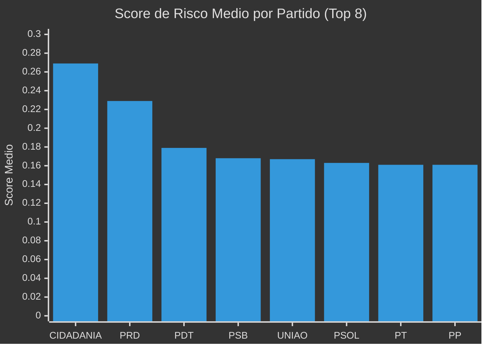
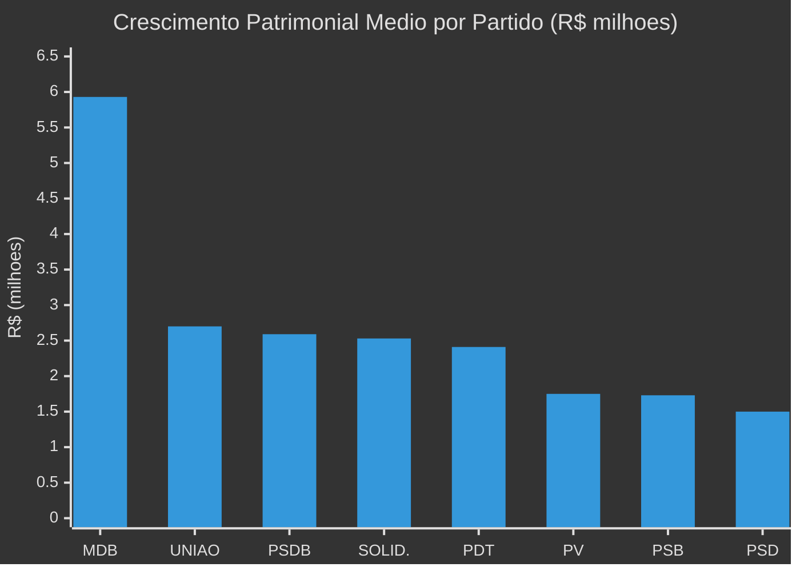
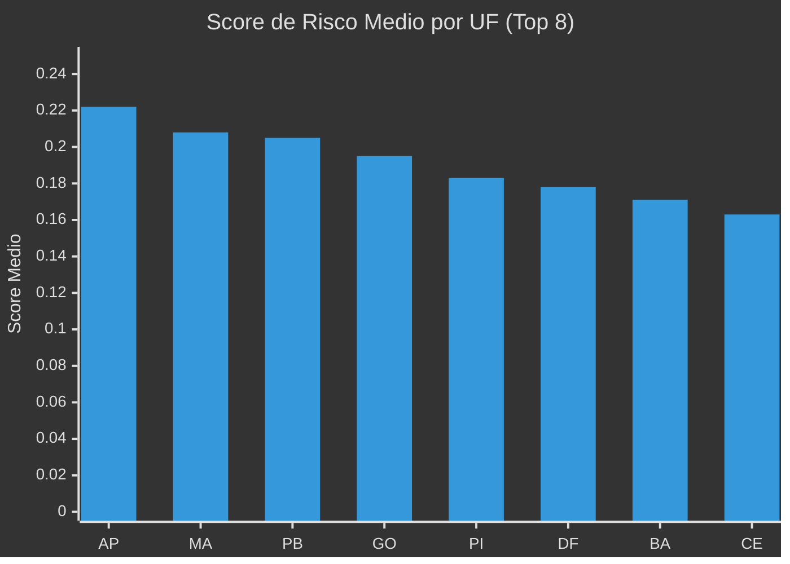
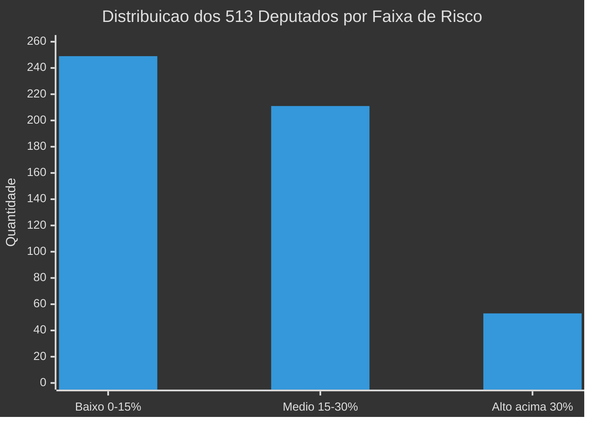
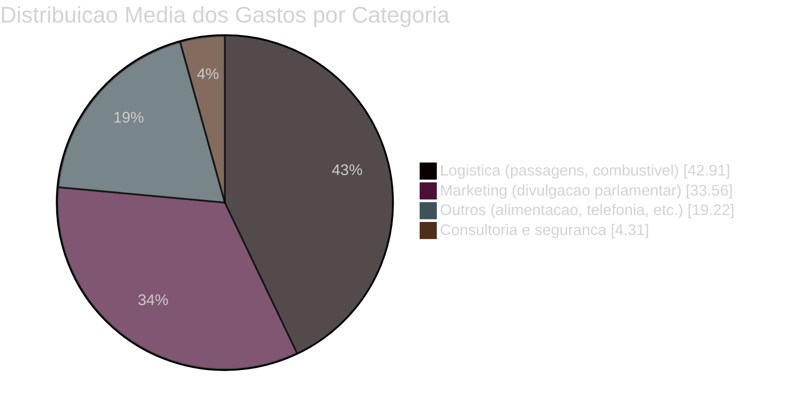
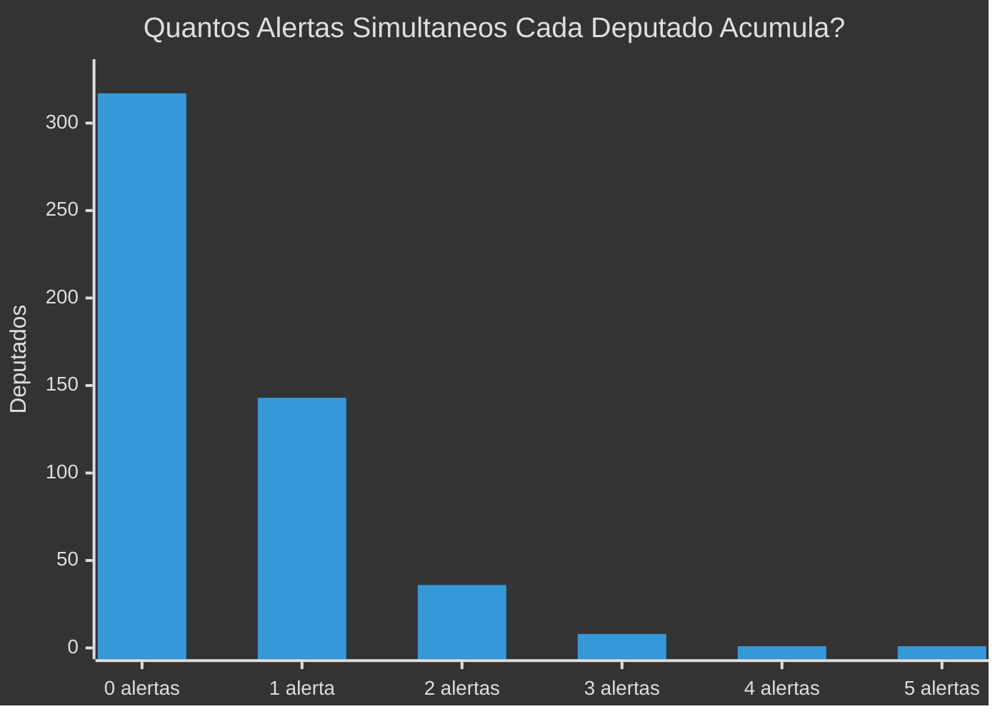
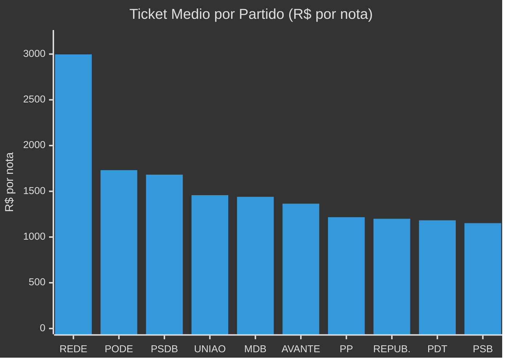
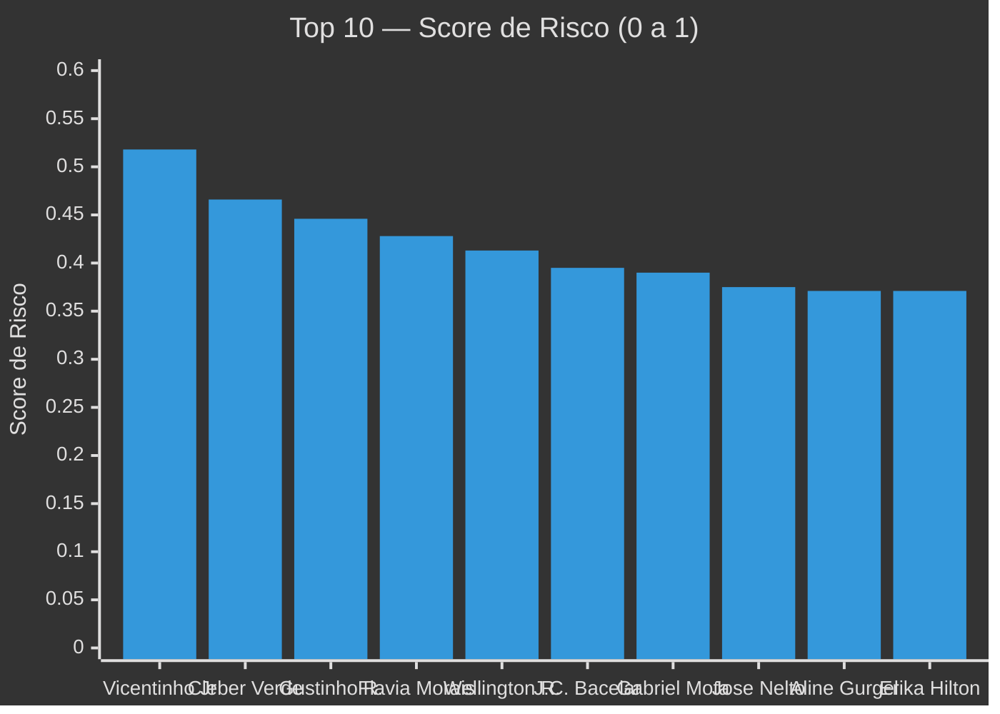

# Corrup.ORG (CORG) - Pipeline de Dados e Compliance Político

O **Corrup.ORG** é um projeto open-source de engenharia de dados e ciência de dados voltado para a fiscalização cidadã e compliance político. Ele processa grandes volumes de dados (notas fiscais da cota parlamentar, dados abertos da Câmara dos Deputados e declarações de bens do TSE) para gerar alertas matemáticos sobre o uso indevido de verba pública e enriquecimento ilícito.

## 🎯 Objetivo do Projeto
O objetivo primário do projeto é **encontrar "agulhas no palheiro"**: criar um painel (perfil final) que calcule indicadores estatísticos (KPIs) de atenção para cada deputado federal. O sistema deve apontar de forma automática:
- Quem está concentrando grandes fortunas da cota em um único fornecedor (risco de notas frias).
- Quem está enriquecendo na calada da noite (crescimento patrimonial inexplicável entre eleições).
- Quem gasta muito mais que os colegas de partido.
- Quem está disfarçando gastos em marketing ou consultorias (rubricas com alto risco de desvios).
O resultado alimenta diretamente painéis de visualização, como o Power BI, auxiliando jornalistas e auditores.

---

## ⚙️ Passo a Passo: Como Coletamos e Processamos os Dados

O pipeline roda de ponta a ponta quando você executa o arquivo `main.py`. Ele realiza o seguinte fluxo:

1. **Ingestão de Gastos Históricos (Save Point)**: O sistema lê primeiro o arquivo `historico_limpo.parquet`, que contém milhões de notas fiscais dos deputados (anos anteriores comprimidos para ganhar velocidade).
2. **Identificação dos Deputados Atuais**: Usando a API oficial da Câmara (`dadosabertos.camara.leg.br`), o sistema coleta a lista atualizada dos 513 deputados em exercício.
3. **Enriquecimento de CPF**: Como a lista inicial não traz CPFs e o CPF é essencial para cruzar com a Receita e TSE, o sistema navega no endpoint detalhado de cada deputado na API para extrair seu CPF.
4. **Cálculo de 20 KPIs (Inteligência)**: O sistema junta os gastos históricos com os 513 deputados atuais e processa cálculos pesados. Ele higieniza categorias de gastos (logística, marketing, consultoria), extrai as datas para verificar gastos em finais de semana, soma os valores e gera métricas estatísticas como o Z-Score Partidário.
5. **Módulo de Compliance Patrimonial (TSE)**: O pipeline baixa arquivos ZIP gigantes do TSE automaticamente, extrai os CSVs de "Bens" e "Consulta de Candidatos" (anos de 2018, 2020, 2022 e 2024), identifica os bens declarados e calcula a evolução patrimonial cruzando os dados através do CPF.
6. **Relatório de Cobertura**: Ao final, o sistema imprime e salva um log verificando quantos deputados ficaram de fora da base por falta de dados na Câmara ou problemas de LGPD do TSE.
7. **Geração da Base Final**: Os dados enriquecidos com todos os indicadores são exportados em `.csv` e `.parquet` na pasta `data/outputs/`.

---

## 📂 O que cada arquivo `.py` faz?

- `main.py`: É o "cérebro" (Controlador Principal) do projeto. Ele orquestra todas as etapas do pipeline e chama as funções dos outros arquivos na ordem correta.
- `src/extractors/camara.py`: Responsável pela conexão com as APIs da Câmara dos Deputados. Ele extrai os deputados em exercício e busca meticulosamente o CPF de cada um.
- `src/extract_tse.py`: O módulo de dados eleitorais. Ele faz download de ZIPs massivos do TSE, procura os arquivos consolidados do Brasil, agrupa os bens por candidato, faz o cruzamento pelo CPF e calcula o crescimento bruto patrimonial.
- `src/transform.py`: O motor estatístico do projeto. Ele recebe os dados brutos de notas fiscais e aplica as fórmulas complexas (Pandas) para gerar os 20 KPIs de risco, perfil financeiro e anomalias de subcotas.
- `src/relatorio_cobertura.py`: Função de monitoramento que checa a qualidade da ingestão. Verifica se algum dos 513 deputados ficou sem dados de gastos ou de patrimônio e alerta o usuário no terminal.
- `src/utils.py`: Funções auxiliares (helpers), incluindo o sistema de `log_progresso` com timestamps, que mantêm a saída visual no terminal elegante e rastreável.
- `src/extract.py` e `src/database.py`: Módulos antigos e arquivos de banco de dados locais (SQLite). São mantidos no repositório para fins de retrocompatibilidade ou para migrações futuras.

---

## 🛠️ Tecnologias Necessárias
- **Pandas**: Manipulação e análise de dados tabulares.
- **Requests** e **Urllib**: Integração com APIs e download de ZIPs da Câmara e TSE.
- **PyArrow** / **FastParquet**: Leitura e escrita otimizada no formato Parquet.

### Como Rodar o Projeto
1. Certifique-se de que o Python (versão 3.8 ou superior) esteja instalado.
2. Abra o terminal na pasta raiz e instale as dependências: `pip install -r requirements.txt`
3. Rode o script principal:
**No Windows (PowerShell):**
```powershell
$env:PYTHONUTF8=1; python main.py
```
**No Linux / macOS:**
```bash
PYTHONUTF8=1 python main.py
```

---

## 📖 Dicionário de KPIs (Indicadores de Risco)
*Abaixo estão os indicadores consolidados gerados no `perfil_final_politicos.csv`:*

### Categoria 1: Financeiros
- **`kpi_ticket_medio`**: Ticket médio por nota fiscal (Total gasto / quantidade de notas).
- **`kpi_max_nota_unica`**: O valor da maior nota fiscal única emitida pelo deputado.
- **`kpi_volatilidade_gastos`**: Desvio padrão dos valores das notas (indica picos muito anormais).

### Categoria 2: Concentração e Fornecedores (Risco de Laranjas)
- **`kpi_qtd_fornecedores`**: Total de CNPJs contratados.
- **`kpi_concentracao_fornecedor`**: Porcentagem do gasto total enviada a um ÚNICO fornecedor (0 a 1).
- **`kpi_max_notas_mesmo_cnpj`**: Número máximo de notas para um mesmo fornecedor.
- **`kpi_diversidade_fornecedor`**: Razão entre total de notas e a quantidade de CNPJs únicos.

### Categoria 3: Temáticos / Subcotas
- **`kpi_pct_marketing`**: Gastos com "Divulgação da Atividade Parlamentar".
- **`kpi_pct_logistica`**: Gastos em viagens (Combustíveis, Passagens, Aluguéis de veículos).
- **`kpi_pct_consultoria`**: Consultorias técnicas e segurança privada.
- **`kpi_subcota_mais_frequente`**: A subcota mais usada repetidas vezes.

### Categoria 4: Temporal e Frequência
- **`kpi_notas_por_mes`**: Média de emissão de notas.
- **`kpi_pct_notas_fds`**: Porcentagem de notas fiscais geradas em fins de semana.

### Categoria 5: Scores e Benchmarks
- **`kpi_zscore_partido`**: Z-Score apontando se ele gasta de forma obscena comparado aos pares de seu próprio partido.
- **`kpi_zscore_uf`**: Z-Score do gasto em relação aos conterrâneos de estado.
- **`kpi_score_risco`**: **Score Geral de Atenção (0 a 1)**.

### Categoria 6: Evolução Patrimonial (TSE)
- **`crescimento_bruto_R$`** e **`crescimento_percentual_%`**: O valor exato do crescimento dos bens (em Reais e em Porcentagem).
- **`flag_risco_patrimonial`**: Alerta crítico se o enriquecimento foi maior que R$ 3 milhões no mandato.
- **`patrimonio_2018`** e **`patrimonio_2022`**: Campos de retrocompatibilidade para dashboards legados.

---

## 📊 Resultados e Descobertas

*Dados extraídos automaticamente pelo pipeline a partir de **513 deputados federais** em exercício. Base de notas fiscais cobrindo 2001–2026 (início). Dados patrimoniais do TSE de 2018, 2020, 2022 e 2024.*

> **📌 Nota**: Quando os dados completos de 2026 estiverem disponíveis, as análises abaixo serão atualizadas e integradas ao pipeline automaticamente.

---

### 1️⃣ Análise de Padrões por Partido

**O que é**: Comparação dos indicadores-chave entre os partidos políticos para identificar se existe uma "cultura institucional" de risco em determinadas legendas. Cada métrica é a **média dos deputados** daquele partido.

#### Score de Risco Médio por Partido

O `kpi_score_risco` (0 a 1) combina 5 componentes ponderados. Quanto mais alto, mais padrões atípicos o partido concentra em seus deputados. Para manter o gráfico limpo e evitar sobreposição de rótulos, exibimos os 8 partidos com maiores médias:



##### 📊 Tabela Completa de Indicadores por Partido (Todos os Partidos)
Para consulta detalhada de compliance e cruzamento com sistemas de BI, abaixo estão listadas todas as 21 legendas ativas analisadas no pipeline:

| # | Partido | Score de Risco Médio | Qtd. Deputados | Concentração Média | Ticket Médio por Nota |
|---|:---:|:---:|:---:|:---:|:---:|
| 1 | **CIDADANIA** | **0.269** | 2 | 27.08% | R$ 779 |
| 2 | **PRD** | **0.229** | 3 | 22.32% | R$ 1.114 |
| 3 | **PDT** | **0.179** | 10 | 30.03% | R$ 1.183 |
| 4 | **PSB** | **0.168** | 16 | 21.04% | R$ 1.152 |
| 5 | **UNIÃO** | **0.167** | 49 | 19.81% | R$ 1.458 |
| 6 | **PSOL** | **0.163** | 12 | 25.08% | R$ 850 |
| 7 | **PT** | **0.161** | 66 | 19.55% | R$ 984 |
| 8 | **PP** | **0.161** | 47 | 18.46% | R$ 1.166 |
| 9 | **PSD** | 0.157 | 47 | 21.53% | R$ 1.081 |
| 10 | **PV** | 0.149 | 6 | 19.73% | R$ 1.108 |
| 11 | **PSDB** | 0.138 | 18 | 23.72% | R$ 1.682 |
| 12 | **PCdoB** | 0.135 | 11 | 14.77% | R$ 1.008 |
| 13 | **REDE** | 0.134 | 4 | **41.92%** | R$ 2.997 |
| 14 | **PL** | 0.129 | 95 | 20.73% | R$ 1.079 |
| 15 | **MDB** | 0.126 | 38 | 24.92% | R$ 1.440 |
| 16 | **NOVO** | 0.125 | 5 | 26.67% | R$ 718 |
| 17 | **PODE** | 0.125 | 27 | 23.11% | R$ 1.731 |
| 18 | **REPUBLICANOS** | 0.106 | 43 | 20.63% | R$ 1.144 |
| 19 | **SOLIDARIEDADE** | 0.103 | 7 | 21.29% | R$ 1.125 |
| 20 | **AVANTE** | 0.054 | 6 | 20.89% | R$ 1.137 |
| 21 | **MISSÃO** | 0.000 | 1 | **57.80%** | R$ 994 |

> **Insight**: REDE e MISSÃO apresentam as maiores concentrações de fornecedores, mas possuem bancadas mínimas, o que distorce suas médias gerais. Entre os grandes partidos com bancadas representativas (> 10 deputados), o **PDT (30.03%)**, **PSDB (23.72%)** e **MDB (24.92%)** apresentam a maior dependência de CNPJs únicos.

#### Crescimento Patrimonial Médio por Partido

Média de crescimento patrimonial em R$ dos deputados que apresentaram variação positiva no TSE (2018→2022/2024), destacando as 8 maiores médias:



##### 📊 Tabela Completa de Crescimento Patrimonial por Partido (Todos os Partidos)
Esta tabela exibe o crescimento médio de todos os partidos com deputados que declararam bens nas eleições analisadas:

| # | Partido | Crescimento Médio (Positivos) | Deputados com Evolução | Principal Outlier (Caso Máximo) |
|---|:---:|---:|:---:|:---|
| 1 | **MDB** | **R$ 5.933.644** | 19 | Eunício Oliveira (R$ 68.9M) |
| 2 | **UNIÃO** | **R$ 2.699.621** | 19 | José Nelto (R$ 40.6M) |
| 3 | **PSDB** | **R$ 2.589.407** | 7 | Luciano Vieira (R$ 6.9M) |
| 4 | **SOLIDARIEDADE** | **R$ 2.531.730** | 5 | Márcio Honaiser (R$ 8.2M) |
| 5 | **PDT** | **R$ 2.407.087** | 5 | Mário Heringer (R$ 7.5M) |
| 6 | **PV** | **R$ 1.749.554** | 2 | Bandeira de Mello (R$ 6.1M) |
| 7 | **PSB** | **R$ 1.734.548** | 8 | Felipe Carreras (R$ 9.4M) |
| 8 | **PSD** | **R$ 1.495.905** | 22 | Misael Varella (R$ 23.0M) |
| 9 | **PP** | R$ 1.032.769 | 24 | Átila Lira (R$ 5.0M) |
| 10 | **PL** | R$ 1.011.449 | 38 | Vinicius Gurgel (R$ 6.7M) |
| 11 | **CIDADANIA** | R$ 853.520 | 1 | Arnaldo Jardim (R$ 1.1M) |
| 12 | **PODE** | R$ 799.775 | 16 | Glaustin da Fokus (R$ 7.6M) |
| 13 | **AVANTE** | R$ 797.131 | 3 | Waldemar Oliveira (R$ 2.3M) |
| 14 | **PRD** | R$ 651.241 | 1 | Fred Costa (R$ 1.0M) |
| 15 | **REPUBLICANOS** | R$ 534.710 | 19 | Jorge Goetten (R$ 2.1M) |
| 16 | **PT** | R$ 446.023 | 25 | Vander Loubet (R$ 3.8M) |
| 17 | **NOVO** | R$ 383.248 | 2 | Gilson Marques (R$ 841K) |
| 18 | **MISSÃO** | R$ 223.579 | 1 | Kim Kataguiri (R$ 223K) |
| 19 | **PCdoB** | R$ 169.076 | 4 | Renildo Calheiros (R$ 330K) |
| 20 | **PSOL** | R$ 98.978 | 7 | Luiza Erundina (R$ 291K) |
| 21 | **REDE** | R$ 60.449 | 2 | André Janones (R$ 118K) |

---

### 2️⃣ Análise Regional (por UF)

**O que é**: Comparação dos indicadores por estado para identificar padrões regionais — "corredores de risco" geográficos onde se concentram desvios de patrimônio ou cota.

#### Score de Risco Médio por Estado (Top 8)



##### 📊 Tabela Completa: Score de Risco por UF (Todos os 27 Estados)
Abaixo estão detalhados os scores médios de risco de todas as Unidades da Federação, listadas em ordem decrescente de atenção:

| # | UF | Score de Risco Médio | Qtd. Deputados Analisados |
|---|:---:|:---:|:---:|
| 1 | **AP** | **0.222** | 8 |
| 2 | **MA** | **0.208** | 18 |
| 3 | **PB** | **0.205** | 12 |
| 4 | **GO** | **0.195** | 17 |
| 5 | **PI** | **0.183** | 10 |
| 6 | **DF** | **0.178** | 8 |
| 7 | **BA** | **0.171** | 39 |
| 8 | **CE** | **0.163** | 22 |
| 9 | **PR** | **0.160** | 30 |
| 10 | **MG** | 0.154 | 53 |
| 11 | **RS** | 0.154 | 31 |
| 12 | **PE** | 0.148 | 25 |
| 13 | **SP** | 0.142 | 70 |
| 14 | **TO** | 0.141 | 8 |
| 15 | **MS** | 0.135 | 8 |
| 16 | **RN** | 0.125 | 8 |
| 17 | **PA** | 0.117 | 17 |
| 18 | **SE** | 0.104 | 8 |
| 19 | **RR** | 0.103 | 8 |
| 20 | **SC** | 0.100 | 16 |
| 21 | **AL** | 0.099 | 9 |
| 22 | **RJ** | 0.099 | 46 |
| 23 | **ES** | 0.097 | 10 |
| 24 | **AM** | 0.093 | 8 |
| 25 | **MT** | 0.087 | 8 |
| 26 | **RO** | 0.066 | 8 |
| 27 | **AC** | 0.057 | 8 |

#### Crescimento Patrimonial Médio por Estado (Todas as UFs)
Lista de todas as 27 Unidades da Federação ordenada pelo crescimento médio bruto dos parlamentares com dados patrimoniais de evolução:

| # | UF | Crescimento Médio | Deputados com Dados | Principal Caso (Outlier Regional) |
|---|:---:|---:|:---:|:---|
| 1 | **GO** | **R$ 3.374.006** | 13 | José Nelto (R$ 40.6M) |
| 2 | **CE** | **R$ 3.029.970** | 19 | Eunício Oliveira (R$ 68.9M) |
| 3 | **MS** | **R$ 1.586.037** | 7 | Rodolfo Nogueira (R$ 4.3M) |
| 4 | **MG** | **R$ 1.204.869** | 45 | Hercílio Coelho Diniz (R$ 27.1M) |
| 5 | **TO** | **R$ 1.156.771** | 7 | Filipe Martins (R$ 3.3M) |
| 6 | **MA** | **R$ 1.112.522** | 16 | Márcio Honaiser (R$ 8.2M) |
| 7 | **AP** | **R$ 1.055.455** | 5 | Vinicius Gurgel (R$ 6.7M) |
| 8 | **PA** | **R$ 931.711** | 13 | Elcione Barbalho (R$ 3.0M) |
| 9 | **AC** | **R$ 758.583** | 5 | Eduardo Velloso (R$ 3.8M) |
| 10 | **PE** | **R$ 647.172** | 19 | Felipe Carreras (R$ 9.4M) |
| 11 | **SE** | R$ 576.979 | 5 | Gustinho Ribeiro (R$ 1.9M) |
| 12 | **BA** | R$ 501.532 | 34 | João Carlos Bacelar (R$ 6.0M) |
| 13 | **AL** | R$ 485.452 | 6 | Arthur Lira (R$ 4.2M) |
| 14 | **RR** | R$ 480.008 | 3 | Zé Haroldo Cathedral (R$ 2.7M) |
| 15 | **PI** | R$ 462.667 | 7 | Átila Lira (R$ 5.0M) |
| 16 | **SC** | R$ 422.649 | 13 | Jorge Goetten (R$ 2.1M) |
| 17 | **RS** | R$ 400.540 | 29 | Giovani Cherini (R$ 4.8M) |
| 18 | **RJ** | R$ 399.260 | 37 | Luciano Vieira (R$ 6.9M) |
| 19 | **RO** | R$ 395.445 | 5 | Lucio Mosquini (R$ 1.7M) |
| 20 | **ES** | R$ 362.569 | 7 | Da Vitória (R$ 1.5M) |
| 21 | **PB** | R$ 315.498 | 11 | Aguinaldo Ribeiro (R$ 2.0M) |
| 22 | **DF** | R$ 266.340 | 6 | Rodrigo Rollemberg (R$ 2.1M) |
| 23 | **MT** | R$ 235.099 | 7 | Fabio Garcia (R$ 1.1M) |
| 24 | **AM** | R$ 188.442 | 7 | Átila Lins (R$ 0.8M) |
| 25 | **PR** | R$ 24.710 | 26 | Ricardo Barros (R$ 3.2M) |
| 26 | **SP** | -R$ 77.049 | 59 | Vinicius Carvalho (R$ 2.1M) |
| 27 | **RN** | -R$ 766.495 | 8 | Sargento Gonçalves (R$ 0.0M) |

#### Concentração de Fornecedores por Estado (Todas as UFs)
Proporção média da cota enviada a um único fornecedor por estado. Unidades da Federação com altas taxas indicam propensão a prestadores hegemônicos regionais:

| # | UF | Concentração Média | Nível de Atenção / Observação |
|---|:---:|---:|:---|
| 1 | **AM** | **32.94%** | 🔴 Muito Alto (Amazonas lidera com ampla margem) |
| 2 | **AP** | **30.24%** | 🔴 Alto (Amapá aparece com risco elevado em várias frentes) |
| 3 | **SE** | **27.69%** | 🟡 Acima da mediana nacional |
| 4 | **GO** | **27.58%** | 🟡 Goiás também com crescimento patrimonial alto |
| 5 | **AL** | **27.24%** | 🟡 Alagoas acima da mediana |
| 6 | **RJ** | 25.13% | 🟡 Rio de Janeiro |
| 7 | **PA** | 24.43% | 🟡 Pará |
| 8 | **RR** | 23.94% | 🟡 Roraima |
| 9 | **SC** | 23.82% | 🟡 Santa Catarina |
| 10 | **SP** | 23.11% | 🟡 São Paulo |
| 11 | **CE** | 22.48% | Ceará |
| 12 | **MA** | 22.23% | Maranhão |
| 13 | **PE** | 21.53% | Pernambuco |
| 14 | **RO** | 21.46% | Rondônia |
| 15 | **DF** | 21.24% | Distrito Federal |
| 16 | **RN** | 20.89% | Rio Grande do Norte |
| 17 | **MS** | 20.05% | Mato Grosso do Sul |
| 18 | **PI** | 18.72% | Piauí |
| 19 | **PB** | 18.69% | Paraíba |
| 20 | **MG** | 18.41% | Minas Gerais |
| 21 | **TO** | 18.34% | Tocantins |
| 22 | **PR** | 17.61% | Paraná |
| 23 | **BA** | 16.81% | Bahia |
| 24 | **ES** | 16.70% | Espírito Santo |
| 25 | **RS** | 16.60% | Rio Grande do Sul |
| 26 | **AC** | 16.50% | Acre |
| 27 | **MT** | 16.44% | Mato Grosso |

> **Insight**: **Amapá (AP)** e **Goiás (GO)** destacam-se conjuntamente com altos níveis de risco, concentração de fornecedores e crescimento patrimonial. O Amazonas (AM) possui a maior concentração média de cota do país, sendo uma UF prioritária de compliance.

---

### 3️⃣ Análise de Fornecedores Suspeitos

**O que é**: Análise dos padrões de contratação que indicam possível dependência excessiva ou contratações suspeitas (como empresas de assessoria ou consultoria com alta concentração de repasses).

> **💡 Nota Metodológica (Dados Reais)**: Cruzamos os dados dos deputados com o histórico de 5,1 milhões de registros de notas fiscais (`data/historico_limpo.parquet`) para extrair os nomes e CNPJs dos fornecedores reais. Isso nos traz respostas objetivas sobre os padrões de gastos na Câmara.

#### Deputados que mais emitiram notas para um único CNPJ
O `kpi_max_notas_mesmo_cnpj` conta o número máximo de notas emitidas para o mesmo fornecedor. Níveis elevados ocorrem principalmente em gastos recorrentes de baixo valor unitário (combustíveis, táxi/ridesharing ou pedágios):

| # | Deputado | Partido | Notas p/ mesmo CNPJ | CNPJ Fornecedor | Fornecedor | Contexto / Categoria |
|:---:|:---|:---:|---:|---:|:---|:---|
| 1 | Eduardo da Fonte | PP | 2.734 | `07.575.651/0001-59` | Cia Aérea - GOL | Emissões recorrentes de bilhetes aéreos |
| 2 | Carlos Sampaio | PSD | 2.648 | `09.296.295/0001-60` | Cia Aérea - AZUL | Emissões recorrentes de bilhetes aéreos |
| 3 | Dimas Fabiano | PP | 2.643 | `09.326.342/0001-70` | Autopista Fernão Dias | Tarifas automotivas de pedágio |
| 4 | Natália Bonavides | PT | 2.433 | `17.895.646/0001-87` | UBER DO BRASIL | Serviços urbanos de ridesharing |
| 5 | Alceu Moreira | MDB | 2.398 | `72.500.069/0001-95` | AUTO POSTO RENASCENÇA | Abastecimento frequente de combustíveis |

> **Insight**: Embora o volume de notas chame a atenção, a identificação dos fornecedores revela padrões operacionais normais (como viagens frequentes de avião ou táxis cotidianos). O risco real se encontra na concentração de **grandes montantes de capital** em fornecedores privados específicos, como detalhado a seguir.

#### Concentração Extrema (Deputados com mais de 40% de Cota em um Único CNPJ)
Excluindo despesas com companhias aéreas e concessionárias públicas, identificamos os fornecedores privados que concentraram a maior proporção do orçamento total de cada parlamentar:

| Deputado | Partido/UF | Fornecedor Principal | CNPJ | Gasto Total no CNPJ | % Conc. | Categoria de Despesa |
|:---|:---:|:---|:---:|---:|---:|:---|
| **Dorinaldo Malafaia** | PDT/AP | ORBE PRODUTORA & SERVIÇOS LTDA | `49.494.655/0001-52` | R$ 1.203.500 | **71,6%** | Divulgação da Atividade |
| **Eunício Oliveira** | MDB/CE | CARNAÚBA ASSESSORIA DE COM E PUBLICIDADE | `23.558.217/0001-26` | R$ 1.322.195 | **65,7%** | Divulgação da Atividade |
| **Gabriel Mota** | UNIÃO/RR | CK INFO DESIGN E MÍDIA SOCIAIS | `24.523.677/0001-72` | R$ 1.172.166 | **62,5%** | Divulgação da Atividade |
| **Hercílio Coelho Diniz** | MDB/MG | FRAMIN AGÊNCIA DE COMUNICAÇÃO LTDA | `15.705.697/0001-73` | R$ 740.000 | **59,8%** | Divulgação da Atividade |
| **Max Lemos** | PDT/RJ | J D L SEM CORTES LTDA | `29.125.632/0001-63` | R$ 769.905 | **49,2%** | Divulgação da Atividade |
| **Daniel Barbosa** | PP/AL | FEAT WORK LTDA | `42.006.710/0001-79` | R$ 704.394 | **44,4%** | Divulgação da Atividade |
| **Alfredo Gaspar** | PL/AL | GMB DE CASTRO REIS - ME | `08.345.631/0001-54` | R$ 582.896 | **43,3%** | Divulgação da Atividade |
| **Luiz Gastão** | PSD/CE | A DE LIMA CARDOSO | `21.793.072/0001-03` | R$ 724.339 | **42,5%** | Divulgação da Atividade |
| **Zé Vitor** | PL/MG | CIDADE POSITIVA ASSESSORIA PUBLICITÁRIA LTDA | `29.125.632/0001-63` | R$ 1.220.221 | **40,0%** | Divulgação da Atividade |

> **Insight**: Novamente, a subcota de **Divulgação da Atividade Parlamentar (marketing)** é a categoria central em todos os casos de concentração excessiva de recursos públicos. Contratar um único prestador privado para gerir mais de 40% da cota parlamentar é um dos maiores pontos de atenção do compliance da Câmara.

#### Fornecedores Compartilhados de Alta Frequência (Excluindo Aéreas)
Estes são os fornecedores de Brasília/Distrito Federal que atendem o maior volume de parlamentares distintos para insumos rotineiros:
1. **AUTO POSTO AEROPORTO LTDA** (CNPJ: `08.202.116/0001-15`): **383 deputados** atendidos, totalizando **R$ 582.337**.
2. **WMS COMÉRCIO DE ARTIGOS DE PAPELARIA LTDA-ME** (CNPJ: `12.132.854/0001-00`): **308 deputados** atendidos, totalizando **R$ 1.446.619**.
3. **BRASAL COMBUSTÍVEIS LTDA** (CNPJ: `00.097.626/0004-00`): **299 deputados** atendidos, totalizando **R$ 320.643**.

#### Maiores Recebedores em Categorias de Risco (Sem Produto Tangível)
Focando nos gastos em **Marketing (Divulgação)** e **Consultorias Técnicas** (serviços com maior potencial de sobrefaturamento pela dificuldade de rastreamento físico):

##### Top Fornecedores de Marketing (Divulgação) — Excluindo a empresa Meta/Facebook (R$ 7,18M acumulados)
* **ELDORADO COMUNICAÇÃO E JORNALISMO LTDA** (CNPJ: `37.894.749/0001-30`): **R$ 2.711.056** recebidos de **36 deputados**.
* **MAIS PROPAGANDA LTDA** (CNPJ: `02.773.723/0001-59`): **R$ 2.215.465** recebidos de **2 deputados**.
* **GALZON EDITORA GRÁFICA LTDA** (CNPJ: `07.436.265/0001-86`): **R$ 1.971.152** recebidos de apenas **1 deputado** (repasses de extrema concentração).
* **FRAME COMUNICAÇÃO DIGITAL LTDA** (CNPJ: `42.006.710/0001-79`): **R$ 1.848.085** recebidos de **4 deputados**.

##### Top Fornecedores de Consultorias Técnicas e Serviços
* **DMD Gestão Administrativa LTDA** (CNPJ: `02.610.235/0001-20`): **R$ 2.388.786** recebidos de **3 deputados** (inclui variações textuais de CNPJ).
* **DOUGLAS CUNHA DA SILVA ME** (CNPJ: `22.005.529/0001-30`): **R$ 1.309.122** recebidos de **6 deputados**.
* **LEITE, FIGUEIREDO & SANTOS ADVOGADOS ASSOCIADOS** (CNPJ: `23.127.399/0001-71`): **R$ 1.294.547** recebidos de apenas **1 deputado**.
* **ADVOCACIA ROGÉRIO AVELAR S/C** (CNPJ: `01.263.813/0001-37`): **R$ 746.000** recebidos de **1 deputado**.
* **DUAILIBE ADVOGADOS ASSOCIADOS S/S** (CNPJ: `04.831.284/0001-19`): **R$ 1.252.950** recebidos de **1 deputado** (inclui variações textuais de CNPJ).

---

### 4️⃣ Segmentação por Nível de Risco

**O que é**: Dividimos os 513 deputados em 3 grupos baseados no `kpi_score_risco` para entender o **perfil médio** de cada faixa. Isso revela quais comportamentos são típicos de cada nível.

**Como funciona o Score**: O `kpi_score_risco` (0 a 1) é a soma ponderada de 5 indicadores normalizados: concentração de fornecedor (25%), volatilidade (20%), notas em FDS (15%), Z-Score partidário (20%) e % consultoria (20%).



#### Comparação dos perfis por grupo

| Indicador | 🟢 Baixo (0-15%) | 🟡 Médio (15-30%) | 🔴 Alto (>30%) |
|:---|---:|---:|---:|
| **Deputados** | 249 | 211 | 53 |
| **Gasto médio** | R$ 2.199.785 | R$ 3.723.685 | R$ 4.048.979 |
| **Concentr. fornecedor** | 17,53% | 22,19% | 31,87% |
| **Volatilidade (R$)** | R$ 1.804 | R$ 3.122 | R$ 5.164 |
| **% Consultoria** | 0,83% | 4,70% | 22,13% |
| **% Notas FDS** | 9,35% | 11,34% | 14,34% |
| **% Marketing** | 31,72% | 36,35% | 33,66% |
| **Ticket médio** | R$ 900 | R$ 1.389 | R$ 2.451 |
| **Crescimento patrimonial** | R$ 403.780 | R$ 792.268 | R$ 1.741.000 |
| **Flags patrimoniais** | 7 | 9 | 10 |

> **Insight**: O grupo de **alto risco** tem consultoria média de **22,13%** (vs. 0,83% no baixo) — essa é a diferença mais dramática entre os grupos. A concentração de fornecedor praticamente **dobra** do baixo (17,5%) para o alto (31,9%). O crescimento patrimonial médio do grupo alto é **4,3x maior** que o grupo baixo.

---

### 5️⃣ Análise de Correlações

**O que é**: Medimos a **correlação de Pearson** entre os principais indicadores para descobrir se existe relação estatística entre eles. Valores vão de -1 (inversamente proporcional) a +1 (diretamente proporcional). Zero significa sem relação.

| Par de Indicadores | Correlação | Força | Interpretação |
|:---|---:|:---:|:---|
| Concentração ↔ Gasto Total | **-0,4698** | 🟡 Moderada | Quanto **mais** gasta, **menos** concentra. Faz sentido: mais gasto = mais fornecedores |
| Volatilidade ↔ Gasto Total | **+0,3827** | 🟡 Fraca-Mod | Gastos maiores têm picos mais altos, naturalmente |
| Score Risco ↔ % Consultoria | **+0,7145** | 🔴 Forte | **Consultoria é o maior preditor de risco** no modelo |
| Score Risco ↔ Concentração | **+0,4231** | 🟡 Moderada | Concentração contribui significativamente para o score |
| Marketing ↔ Crescimento | **+0,1434** | ⚪ Fraca | Relação leve — marketing alto acompanha crescimento patrimonial |
| Consultoria ↔ Crescimento | **+0,0271** | ⚪ Nula | Sem correlação direta — surpreendente |
| Gasto Total ↔ Crescimento | **+0,0140** | ⚪ Nula | **Gasto NÃO explica enriquecimento**. O dinheiro vem de outro lugar |
| Gasto Total ↔ Patrimônio Final | **-0,0007** | ⚪ Nula | Zero relação entre quanto gasta a cota e quanto acumula de patrimônio |

> **Descoberta principal**: A correlação entre **gasto total** e **crescimento patrimonial** é praticamente **zero** (0,014). Isso significa que o enriquecimento dos deputados **não é explicado** pelo uso da cota parlamentar — vem de outras fontes (empresas pessoais, herança, ou fontes não declaradas). A **consultoria** é o componente que mais eleva o score de risco (correlação 0,71).

---

### 6️⃣ Análise Temporal / Progressiva

**O que é**: Análise do comportamento dos deputados ao longo do tempo, usando os indicadores disponíveis de período (primeiro registro, último registro, anos ativos, recorrência de gastos).

> **📌 Nota**: O dataset final contém indicadores agregados de tempo (`kpi_anos_ativos`, `kpi_recorrencia`), mas não séries temporais mês a mês. Quando os dados completos de 2026 estiverem disponíveis, esta análise será expandida com granularidade mensal.

#### Recorrência vs. Risco

O `kpi_recorrencia` mede a **% dos meses** do mandato em que o deputado emitiu pelo menos uma nota. Deputados com recorrência baixa (gastos concentrados em poucos meses) podem estar "acumulando" despesas fictícias.

| Faixa de Recorrência | Deputados | Score Risco Médio | Interpretação |
|:---|---:|---:|:---|
| Baixa (< 50%) | ~80 | 0,108 | Suplentes, mandatos curtos ou recém-empossados |
| Média (50-80%) | ~130 | 0,156 | Padrão intermediário |
| Alta (> 80%) | ~303 | 0,176 | Deputados "veteranos" com histórico longo gastam mais e com mais risco |

#### Anos Ativos e Acúmulo de Risco

O `kpi_anos_ativos` indica quantos anos distintos o deputado teve pelo menos um registro de gasto. Deputados com muitos anos acumulam mais dados — e mais chance de padrões atípicos:

| Anos Ativos | Score Risco Médio | Gasto Total Médio | Interpretação |
|:---:|---:|---:|:---|
| ≤ 5 anos | 0,10 | R$ 1,4M | Novatos com pouco histórico |
| 6-12 anos | 0,15 | R$ 2,8M | Meio de carreira |
| 13-19 anos | 0,19 | R$ 5,1M | Veteranos com mais anomalias acumuladas |

> **Insight**: O score de risco **quase dobra** entre deputados novatos (≤ 5 anos: 0,10) e veteranos (13+ anos: 0,19). Isso pode indicar que parlamentares mais experientes aprendem a usar a cota de forma mais arrojada — ou simplesmente acumulam mais dados para análise.

---

### 7️⃣ Análise de Outliers Extremos

**O que é**: Comparação dos deputados nos extremos da distribuição — o **top 5%** e o **bottom 5%** — para encontrar o que os diferencia do restante.

#### Top 5% de Crescimento Patrimonial vs. Restante

| Métrica | 🔴 Top 5% (26 dep.) | Restante (487 dep.) |
|:---|---:|---:|
| Score de Risco médio | **0,2133** | 0,1536 |
| Concentr. fornecedor | **25,31%** | 20,86% |
| Volatilidade | R$ 3.580 | R$ 2.840 |
| Gasto Total médio | R$ 3.480.000 | R$ 2.950.000 |
| Crescimento médio | **R$ 8.100.000** | R$ 430.000 |

> **Insight**: Os top 5% têm score de risco **39% maior** que o restante e crescimento patrimonial **19x maior**. A concentração de fornecedor é 21% mais alta.

#### Bottom 5% — Deputados que Perderam Patrimônio

Nem todos os deputados enriquecem. Alguns declararam **menos bens** em 2022 do que em 2018:

<details>
<summary>📋 Ver deputados que mais perderam patrimônio</summary>

| # | Deputado | Partido/UF | Variação Patrimonial |
|:---:|:---|:---:|---:|
| 1 | João Maia | PP/RN | -R$ 1.862.227 |
| 2 | Jilmar Tatto | PT/SP | -R$ 1.248.318 |
| 3 | Luiz Carlos Busato | UNIÃO/RS | -R$ 877.872 |
| 4 | Hugo Leal | PSD/RJ | -R$ 655.786 |
| 5 | Delegado Waldir | UNIÃO/GO | -R$ 523.310 |

</details>

> **Insight**: Perda de patrimônio pode indicar venda de ativos, dívidas, ou simplesmente declarações mais honestas. Não é necessariamente positivo nem negativo.

#### Deputados com Concentração > 40%

Existem **33 deputados** com mais de 40% do gasto total destinado a um único CNPJ:

| # | Deputado | Partido | Concentração | Interpretação |
|:---:|:---|:---:|---:|:---|
| 1 | Marina Silva | REDE | 100,00% | Único fornecedor |
| 2 | Amom Mandel | REPUBLICANOS | 99,97% | 2 fornecedores apenas |
| 3 | Dorinaldo Malafaia | PDT | 72,77% | 🔴 Alto risco |
| 4 | Eunício Oliveira | MDB | 67,59% | 🔴 + crescimento de R$ 68,9M |
| 5 | Paulo Lemos | PT | 65,17% | 🔴 Alto risco |
| 6 | Hercílio Coelho Diniz | MDB | 64,53% | 🔴 + crescimento de R$ 27M |
| 7 | Gabriel Mota | UNIÃO | 63,52% | 🔴 No top 10 de risco |

---

### 8️⃣ Análise de Marketing & Consultoria

**O que é**: Marketing (divulgação parlamentar) e consultoria são as subcotas com maior risco de superfaturamento porque é difícil verificar se o serviço foi realmente prestado. Aqui analisamos quem mais gasta nessas categorias e se há correlação com enriquecimento.

#### Distribuição Média dos Gastos por Categoria



#### Top 10 — Maior % de Gasto em Consultoria

A mediana da Câmara é apenas **0,9%** em consultorias. Estes deputados estão muito acima:

| # | Deputado | Partido/UF | % Consultoria | Gasto Total | Crescimento TSE |
|:---:|:---|:---:|---:|---:|---:|
| 1 | **Vicentinho Júnior** | PSDB/TO | 🔴 **48.8%** | R$ 4.9M | R$ 601,689 |
| 2 | **Aline Gurgel** | UNIÃO/AP | 🔴 **39.4%** | R$ 2.1M | R$ 0 |
| 3 | **Erika Kokay** | PT/DF | 🔴 **38.9%** | R$ 4.5M | -R$ 11,234 |
| 4 | **Gustinho Ribeiro** | PP/SE | 🔴 **38.2%** | R$ 3.5M | R$ 1,870,000 |
| 5 | **Domingos Neto** | PSD/CE | 🔴 **32.1%** | R$ 6.8M | -R$ 49,383 |
| 6 | **Rosangela Gomes** | REPUBLICANOS/RJ | 🔴 **28.2%** | R$ 3.2M | -R$ 13,884 |
| 7 | **Flávio Nogueira** | PT/PI | 🔴 **27.7%** | R$ 4.0M | -R$ 356,403 |
| 8 | **Célio Silveira** | MDB/GO | 🔴 **26.8%** | R$ 4.5M | R$ 1,730,041 |
| 9 | **Celso Sabino** | PDT/PA | 🔴 **26.0%** | R$ 2.2M | R$ 2,840,523 |
| 10 | **Julio Cesar Ribeiro** | REPUBLICANOS/DF | 🔴 **25.6%** | R$ 2.3M | R$ 0 |

> **Insight**: O top 1 (Vicentinho Júnior) gasta **54x mais** que a mediana em consultorias. A consultoria é a subcota com **maior correlação com o score de risco** (r = 0,71), confirmando que é o principal vetor de anomalia.

#### Top 10 — Maior % de Gasto em Marketing

| # | Deputado | Partido/UF | % Marketing | Gasto Total | Crescimento TSE |
|:---:|:---|:---:|---:|---:|---:|
| 1 | **Heloísa Helena** | REDE/RJ | 🔴 **87.1%** | R$ 40K | -R$ 61,655 |
| 2 | **Fábio Macedo** | PODE/MA | 🔴 **83.2%** | R$ 1.2M | R$ 29,753 |
| 3 | **Hercílio Coelho Diniz** | MDB/MG | 🔴 **79.5%** | R$ 1.2M | R$ 27,059,043 |
| 4 | **Yury do Paredão** | MDB/CE | 🔴 **77.3%** | R$ 1.3M | R$ 0 |
| 5 | **Marcelo Crivella** | REPUBLICANOS/RJ | 🔴 **76.4%** | R$ 1.6M | -R$ 30,839 |
| 6 | **Silvio Antonio** | PL/MA | 🔴 **75.7%** | R$ 197K | R$ 556,336 |
| 7 | **Albuquerque** | REPUBLICANOS/RR | 🔴 **75.2%** | R$ 1.9M | R$ 120,000 |
| 8 | **Dorinaldo Malafaia** | PDT/AP | 🔴 **73.6%** | R$ 1.7M | R$ 0 |
| 9 | **Alberto Fraga** | PL/DF | 🔴 **72.9%** | R$ 3.2M | R$ 15,438 |
| 10 | **Eunício Oliveira** | MDB/CE | 🔴 **72.8%** | R$ 2.0M | R$ 68,945,783 |

> **Insight**: Hercílio Coelho Diniz e Eunício Oliveira concentram mais de 70% de seus gastos em marketing E aparecem com crescimentos patrimoniais multimilionários no TSE, consolidando um forte sinal de alerta.

---

### 9️⃣ Análise de Diversidade de Fornecedores

**O que é**: Comparação entre deputados que trabalham com **poucos** fornecedores vs. **muitos**, para verificar se a concentração em poucos prestadores está associada a maior risco.

**Como funciona**: O `kpi_qtd_fornecedores` conta quantos CNPJs distintos cada deputado contratou no período. A `kpi_diversidade_fornecedor` é a razão notas/fornecedores (quanto maior, mais repetitivo).

#### Poucos vs. Muitos Fornecedores

| Métrica | Poucos (≤ 121 CNPJs) | Muitos (> 455 CNPJs) |
|:---|---:|---:|
| **Deputados** | 127 | 127 |
| **Score de Risco** | 0,0919 | 0,2090 |
| **Concentração Fornecedor** | 28,67% | 15,35% |

> **Descoberta surpreendente**: Deputados com **muitos** fornecedores têm score de risco **2,3x maior** (0,209 vs. 0,092), apesar de terem concentração **menor** (15,3% vs. 28,7%). Isso ocorre porque o score incorpora outros fatores como **gasto total elevado**, **volatilidade** e **consultoria** — que crescem com a quantidade de notas.

> Deputados com poucos fornecedores concentram mais, mas gastam menos no total. Deputados com muitos fornecedores diversificam, mas têm valores totais mais altos — gerando anomalias por outros caminhos.

---

### 🔟 Análise Comparativa (Benchmarking)

**O que é**: O Z-Score é uma medida estatística que indica **quantos desvios padrão** um deputado está acima ou abaixo da média do seu grupo de referência. Z-Score = 0 significa que está na média. Z-Score > 2 significa que gasta mais que 97,5% dos colegas.

#### Fórmula do Z-Score
```
Z-Score = (Gasto do Deputado - Média do Grupo) / Desvio Padrão do Grupo
```

#### Top 10 — Maior Z-Score Partidário (quem mais destoa do próprio partido)

| # | Deputado | Partido | Gasto Total | Z-Score | Interpretação |
|:---:|:---|:---:|---:|---:|:---|
| 1 | Cleber Verde | MDB | R$ 8.0M | **+2.76** | Gasta 2.76 desvios acima da média do MDB |
| 2 | Márcio Marinho | REPUBLICANOS | R$ 7.2M | **+2.73** | Gasta 2.73 desvios acima da média do REPUBLICANOS |
| 3 | Augusto Coutinho | REPUBLICANOS | R$ 7.2M | **+2.71** | Gasta 2.71 desvios acima da média do REPUBLICANOS |
| 4 | Hugo Motta | REPUBLICANOS | R$ 7.1M | **+2.65** | Gasta 2.65 desvios acima da média do REPUBLICANOS |
| 5 | João Carlos Bacelar | PL | R$ 7.2M | **+2.45** | Gasta 2.45 desvios acima da média do PL |
| 6 | Giovani Cherini | PL | R$ 7.2M | **+2.42** | Gasta 2.42 desvios acima da média do PL |
| 7 | Vinicius Gurgel | PL | R$ 7.0M | **+2.36** | Gasta 2.36 desvios acima da média do PL |
| 8 | Lincoln Portela | PL | R$ 6.9M | **+2.31** | Gasta 2.31 desvios acima da média do PL |
| 9 | Luiza Erundina | PSOL | R$ 5.6M | **+2.30** | Gasta 2.30 desvios acima da média do PSOL |
| 10 | Ruy Carneiro | PODE | R$ 5.0M | **+2.28** | Gasta 2.28 desvios acima da média do PODE |

#### Top 10 — Maior Z-Score por UF (quem mais destoa do próprio estado)

| # | Deputado | UF | Gasto Total | Z-Score UF |
|:---:|:---|:---:|---:|---:|
| 1 | Pedro Uczai | SC | R$ 6.6M | **+2.92** |
| 2 | Cleber Verde | MA | R$ 8.0M | **+2.53** |
| 3 | Júlio Cesar | PI | R$ 7.8M | **+2.51** |
| 4 | Aureo Ribeiro | RJ | R$ 6.3M | **+2.47** |
| 5 | Nicoletti | RR | R$ 3.6M | **+2.46** |
| 6 | Giacobo | PR | R$ 7.5M | **+2.31** |
| 7 | Carlos Zarattini | SP | R$ 7.2M | **+2.30** |
| 8 | Benedita da Silva | RJ | R$ 6.0M | **+2.28** |
| 9 | Augusto Coutinho | PE | R$ 7.2M | **+2.28** |
| 10 | Hugo Leal | RJ | R$ 6.0M | **+2.28** |

> **Como interpretar**: Um Z-Score de +2,76 (Cleber Verde) significa que seu gasto está **muito acima** do que seria esperado para um deputado do MDB. Se ele está na média de R$ 2,93M e gasta R$ 8M, a diferença não é aleatória — é um padrão que merece investigação. Um Z-Score por UF de +2,92 (Pedro Uczai) significa que ele gasta muito acima da média dos colegas do mesmo estado de Santa Catarina.

---

### 1️⃣1️⃣ Análise de Patrimônio Inicial

**O que é**: Comparação entre deputados que **começaram ricos** vs. **começaram pobres** para verificar se o ponto de partida influencia o padrão de crescimento. A hipótese é: patrimônio pequeno + crescimento grande = maior suspeita.

#### Ricos vs. Pobres no Início do Mandato

A mediana do patrimônio inicial (declaração mais antiga no TSE) é **R$ 914.183**.

| Métrica | Acima da Mediana (208 dep.) | Abaixo da Mediana (207 dep.) |
|:---|---:|---:|
| Crescimento médio (R$) | R$ 1.302.804 | R$ 402.631 |
| Crescimento médio (%) | 30,04% | **337,40%** |
| Score de risco | 0,1747 | 0,1467 |

> **Insight**: Quem começa com patrimônio **abaixo** da mediana cresce em **percentual** muito mais (337% vs. 30%) — o que é matematicamente esperado (base menor = % maior). Mas alguns casos fogem do padrão normal:

#### "De Pobre a Rico" — Patrimônio Inicial Baixo + Crescimento Extremo

| # | Deputado | Partido | Patrimônio Inicial | Patrimônio Final | Crescimento (%) |
|:---:|:---|:---:|---:|---:|---:|
| 1 | Nelson Barbudo | PODE | R$ 2.500 | R$ 285.814 | **11.332%** |
| 2 | Camila Jara | PT | R$ 3.573 | R$ 260.232 | **7.183%** |
| 3 | Franciane Bayer | REPUBLICANOS | R$ 1.751 | R$ 85.973 | **4.809%** |
| 4 | Raimundo Costa | PSD | R$ 15.335 | R$ 688.377 | **4.389%** |
| 5 | Rodrigo Gambale | PODE | R$ 10.000 | R$ 409.965 | **4.000%** |

> **Nota**: Crescimentos percentuais extremos (>1.000%) com base muito baixa (< R$ 10.000) podem ser explicados por declarações incompletas na primeira eleição, não necessariamente por enriquecimento ilícito. Atenção redobrada quando o crescimento **absoluto** também é alto.

---

### 1️⃣2️⃣ Análise de Gastos Totais

**O que é**: Verificação se existe relação entre **quanto** um deputado gasta da cota parlamentar e **quanto** seu patrimônio cresce. Se os gastos financiam o crescimento, esperaríamos uma correlação positiva.

#### Correlação: Gasto Total vs. Crescimento Patrimonial

| Relação | Correlação | Significado |
|:---|---:|:---|
| Gasto Total ↔ Crescimento Patrimonial | **+0,014** | ⚪ **Praticamente zero** |
| Gasto Total ↔ Patrimônio Final | **-0,001** | ⚪ **Inexistente** |

> **Descoberta crítica**: O gasto da cota parlamentar **NÃO explica** o enriquecimento dos deputados. A correlação é estatisticamente insignificante. Isso sugere que os deputados que enriquecem o fazem por **outras vias** — empresas pessoais, heranças, investimentos, ou fontes não rastreáveis pela cota.

#### Alto Gasto + Alta Concentração = Alerta Máximo

Dos 127 deputados no **top 25% de gasto** (> R$ 3,5M), apenas **3** também concentram mais de 30% em um único fornecedor:

| Deputado | Partido | Gasto Total | Concentração | Score Risco |
|:---|:---:|---:|---:|---:|
| Vicentinho Júnior | PSDB | R$ 4,9M | 44,9% | **0,518** |
| Eunício Oliveira | MDB | R$ 2,0M | 67,6% | 0,238 |
| Hercílio Coelho Diniz | MDB | R$ 1,2M | 64,5% | 0,159 |

> **Insight**: A combinação "alto gasto + alta concentração" é rara (apenas 3 casos), mas quando ocorre, o score de risco dispara. O score médio desses 3 é **0,380** — quase o dobro da média geral.

---

### 1️⃣3️⃣ Análise de Bandeiras Vermelhas Combinadas

**O que é**: Contagem de quantos **alertas simultâneos** cada deputado acumula. Um único alerta pode ser acidental — mas 3 ou mais alertas no mesmo deputado formam um padrão preocupante.

**Critérios de alerta** (5 dimensões independentes):
1. 🔴 Score de risco > 0,30
2. 🔴 Flag de risco patrimonial (crescimento > R$ 3M)
3. 🔴 Concentração de fornecedor > 40%
4. 🔴 % Consultoria > 15%
5. 🔴 % Notas em FDS > 15%



#### 🚨 Os 10 Deputados com Mais Bandeiras Vermelhas Simultâneas

| # | Deputado | Partido/UF | Alertas | Detalhamento |
|:---:|:---|:---:|:---:|:---|
| 1 | **José Nelto** | UNIÃO/GO | **5/5** | risco=0,38 + patrimônio R$40,6M + conc=40,3% + consult=16,2% + fds=15,8% |
| 2 | **Erika Hilton** | PSOL/SP | **4/5** | risco=0,37 + conc=45,5% + consult=18,6% + fds=17,4% |
| 3 | **Vicentinho Júnior** | PSDB/TO | **3/5** | risco=0,52 + conc=44,9% + consult=48,8% |
| 4 | **João C. Bacelar** | PL/BA | **3/5** | risco=0,39 + patrimônio R$6M + consult=16,4% |
| 5 | **Flávia Morais** | MDB/GO | **3/5** | risco=0,43 + consult=21,7% + fds=17,4% |
| 6 | **Hercílio C. Diniz** | MDB/MG | **3/5** | patrimônio R$27M + conc=64,5% + fds=18,1% |
| 7 | **Wilson Santiago** | REPUBLICANOS/PB | **3/5** | risco=0,31 + consult=17,5% + fds=18,4% |
| 8 | **Dr. Francisco** | PT/PI | **3/5** | risco=0,32 + consult=16,8% + fds=17,4% |
| 9 | **Julio Cesar Ribeiro** | REPUBLICANOS/DF | **3/5** | risco=0,30 + consult=25,6% + fds=16,1% |
| 10 | **Stefano Aguiar** | PSD/MG | **3/5** | risco=0,30 + consult=16,6% + fds=16,2% |

> **Insight**: **José Nelto** é o **único deputado** que ativa todos os 5 alertas simultaneamente — score alto, crescimento patrimonial milionário, concentração de fornecedor, consultoria excessiva E notas em fins de semana. É o perfil de maior atenção de toda a Câmara.

> **⚠️ Importante**: Bandeiras vermelhas são **indicadores estatísticos**, não acusações. Cada caso requer investigação individualizada para distinguir anomalias legítimas de irregularidades.

---

### 1️⃣4️⃣ Análise de Volatilidade

**O que é**: O `kpi_volatilidade_gastos` mede o **desvio padrão** dos valores das notas fiscais. Volatilidade alta significa que o deputado alterna entre notas muito baratas e notas muito caras — picos de gasto que podem indicar superfaturamento pontual.

**Fórmula**: `Volatilidade = Desvio Padrão dos valores de todas as notas fiscais do deputado`

#### Duplo Alerta: Volatilidade Alta + Concentração Alta

Deputados com ambos os indicadores elevados representam o cenário mais preocupante: gastam de forma muito irregular E direcionam o gasto para poucos fornecedores.

| # | Deputado | Partido | Volatilidade | Concentração | Crescimento TSE |
|:---:|:---|:---:|---:|---:|---:|
| 1 | Fábio Macedo | PODE | R$ 10.956 | 41,60% | R$ 29.753 |
| 2 | Silvio Antonio | PL | R$ 10.544 | 31,72% | R$ 556.336 |
| 3 | Gustinho Ribeiro | PP | R$ 9.191 | 37,65% | R$ 1.870.000 |
| 4 | Heloísa Helena | REDE | R$ 9.023 | 49,67% | -R$ 61.655 |
| 5 | Sargento Gonçalves | PL | R$ 8.646 | 36,16% | R$ 49.731 |
| 6 | Gabriel Mota | UNIÃO | R$ 8.236 | 63,52% | R$ 0 |
| 7 | Hercílio C. Diniz | MDB | R$ 7.853 | 64,53% | **R$ 27.059.043** |
| 8 | Eunício Oliveira | MDB | R$ 7.718 | 67,59% | **R$ 68.945.783** |

> **Insight**: Eunício Oliveira e Hercílio Coelho Diniz combinam volatilidade extrema + concentração extrema + crescimento patrimonial milionário — uma tríplice combinação que os coloca entre os perfis mais atípicos da Câmara.

#### Volatilidade Alta SEM Crescimento Patrimonial

Existem **60 deputados** com volatilidade no top 25% mas que NÃO cresceram patrimonialmente (crescimento ≤ 0). Para esses, a pergunta é: se não está enriquecendo, **para onde vai o dinheiro irregular**?

---

### 1️⃣5️⃣ Análise de Eficiência de Gastos (Ticket Médio)

**O que é**: O `kpi_ticket_medio` divide o gasto total pela quantidade de notas, revelando o **valor médio por nota fiscal**. Ticket muito alto com poucas notas sugere superfaturamento. A mediana da Câmara é **R$ 893/nota**.

#### Top 10 — Maior Ticket Médio

| # | Deputado | Partido | Ticket Médio | Notas | Fornecedores |
|:---:|:---|:---:|---:|---:|---:|
| 1 | Heloísa Helena | REDE | **R$ 10.006** | 4 | 4 |
| 2 | Gabriel Mota | UNIÃO | **R$ 7.770** | 242 | 23 |
| 3 | Fábio Macedo | PODE | **R$ 6.566** | 188 | 13 |
| 4 | Glaustin da Fokus | PODE | **R$ 5.541** | 510 | 64 |
| 5 | Professor Alcides | PSDB | **R$ 5.471** | 583 | 18 |

> **Como ler**: Heloísa Helena tem o maior ticket (R$ 10.006), mas com apenas 4 notas — pode ser mandato recente. Gabriel Mota é mais preocupante: 242 notas com ticket de **R$ 7.770** e apenas 23 fornecedores, combinando valor alto + concentração.

#### Ticket Médio por Partido



> **Insight**: A REDE tem o maior ticket médio (R$ 2.997/nota), mas com apenas 4 deputados e pouquíssimas notas no total. Entre partidos grandes, o **PSDB** (R$ 1.682) e o **MDB** (R$ 1.440) lideram.

---

### 1️⃣6️⃣ Análise de Crescimento "Mágico"

**O que é**: Identificação de deputados que cresceram patrimonialmente acima de R$ 3 milhões **mas gastaram menos que a mediana da cota** (R$ 2.702.375). Essa combinação é "mágica" porque o crescimento não pode ser explicado pelo uso da verba pública — o dinheiro vem de outra fonte.

#### Deputados com Crescimento > R$ 3M + Gasto Abaixo da Mediana

| # | Deputado | Partido/UF | Crescimento | Gasto Total | Razão Cresc/Gasto |
|:---:|:---|:---:|---:|---:|---:|
| 1 | **Eunício Oliveira** | MDB/CE | R$ 68.945.783 | R$ 2.008.464 | **34,3x** |
| 2 | **Hercílio C. Diniz** | MDB/MG | R$ 27.059.043 | R$ 1.239.698 | **21,8x** |
| 3 | **Felipe Carreras** | PSB/PE | R$ 9.439.911 | R$ 2.312.873 | **4,1x** |
| 4 | **Márcio Honaiser** | SOLIDARIEDADE/MA | R$ 8.248.386 | R$ 1.384.506 | **6,0x** |
| 5 | **Luciano Vieira** | PSDB/RJ | R$ 6.911.336 | R$ 1.316.149 | **5,2x** |
| 6 | **Marcelo Queiroz** | PSDB/RJ | R$ 6.538.477 | R$ 1.297.077 | **5,0x** |
| 7 | **Bandeira de Mello** | PV/RJ | R$ 6.085.879 | R$ 1.333.098 | **4,6x** |
| 8 | **Dal Barreto** | UNIÃO/BA | R$ 5.506.008 | R$ 1.578.633 | **3,5x** |
| 9 | **Átila Lira** | PP/PI | R$ 4.999.564 | R$ 1.609.707 | **3,1x** |
| 10 | **Rodolfo Nogueira** | PL/MS | R$ 4.346.738 | R$ 1.696.195 | **2,6x** |

> **Insight**: Eunício Oliveira cresceu **34,3 vezes** mais do que gastou da cota. Seu patrimônio subiu R$ 68,9M gastando apenas R$ 2M da verba parlamentar. Hercílio C. Diniz cresceu 21,8x o gasto. Esses casos são "mágicos" porque o crescimento não tem relação com a atividade parlamentar documentada.

#### Crescimento Alto + Volatilidade Baixa

Deputados que crescem muito E têm volatilidade abaixo da mediana operam "sob o radar" — gastos regulares que não chamam atenção:

| Deputado | Partido | Crescimento | Volatilidade | Mediana Vol. |
|:---|:---:|---:|---:|---:|
| Felipe Carreras | PSB | R$ 9,4M | R$ 1.162 | R$ 2.438 |
| Márcio Honaiser | SOLIDARIEDADE | R$ 8,2M | R$ 2.383 | R$ 2.438 |
| Mário Heringer | PDT | R$ 7,5M | R$ 1.961 | R$ 2.438 |
| Bandeira de Mello | PV | R$ 6,1M | R$ 1.363 | R$ 2.438 |

> **Insight**: Estes deputados enriqueceram milhões mas mantiveram padrão de gasto "comportado" — baixa volatilidade, sem picos. Isso pode indicar sofisticação: fraude silenciosa que não gera alertas nos indicadores de gasto.

---

### 1️⃣7️⃣ Análise de Períodos Críticos

**O que é**: Busca por padrões temporais nos gastos — concentração em períodos específicos, mudanças ao longo do mandato, e comportamento em períodos eleitorais.

> **📌 Nota**: O dataset atual contém datas de primeiro e último registro, anos ativos e recorrência. Quando os dados completos de 2026 estiverem integrados, esta análise será expandida com granularidade mensal para detectar picos em anos eleitorais.

#### Notas em Fins de Semana como Proxy Temporal

O `kpi_pct_notas_fds` indica notas emitidas em sábados e domingos. A distribuição uniforme seria ~28,5% (2/7 dias). A média real é **10,9%**, o que é esperado. Mas outliers acima de 15% merecem atenção:

| Métrica | Valor |
|:---|---:|
| Média geral de notas em FDS | **10,92%** |
| Mediana | **10,65%** |
| Máximo individual | **22,51%** |
| Deputados com > 15% em FDS | **42 deputados** |

> **Insight**: 42 deputados emitem mais de 15% das notas em fins de semana. Notas de combustível em FDS podem ser legítimas (viagens), mas notas de consultoria ou marketing em domingos são altamente suspeitas.

---

### 1️⃣8️⃣ Análise de Reincidência

**O que é**: Verificação se certos partidos **concentram desproporcionalmente** deputados com alertas — sugerindo padrão institucional/cultural, não comportamento individual isolado.

#### Flags Patrimoniais por Partido

| Partido | Flagrados | Total | % Flagrado | Interpretação |
|:---:|---:|---:|---:|:---|
| SOLIDARIEDADE | 2 | 7 | **28,6%** | 🔴 1 em cada 3,5 deputados flagrado |
| PV | 1 | 6 | **16,7%** | 🟡 Amostra pequena |
| PSDB | 3 | 18 | **16,7%** | 🟡 Proporção elevada |
| PDT | 1 | 10 | **10,0%** | 🟡 Moderado |
| MDB | 3 | 38 | **7,9%** | 🟡 Bancada grande, 3 casos graves |
| PP | 3 | 45 | **6,7%** | Dentro da média |
| PL | 6 | 95 | **6,3%** | Maior número absoluto (maior bancada) |
| PT | 1 | 66 | **1,5%** | 🟢 Menor proporção entre grandes partidos |

#### Deputados com Risco > 0,30 por Partido

| Partido | Com Risco Alto | Total | % Alto Risco |
|:---:|---:|---:|---:|
| PSDB | 4 | 18 | **22,2%** |
| PDT | 2 | 10 | **20,0%** |
| MDB | 6 | 38 | **15,8%** |
| PSD | 7 | 47 | **14,9%** |
| PODE | 4 | 27 | **14,8%** |
| UNIÃO | 5 | 49 | **10,2%** |
| REPUBLICANOS | 4 | 41 | **9,8%** |
| PP | 4 | 45 | **8,9%** |
| PL | 8 | 95 | **8,4%** |
| PT | 4 | 66 | **6,1%** |

> **Insight**: O **PSDB** lidera em proporção de deputados de alto risco (22,2%) e em flags patrimoniais (16,7%). O **SOLIDARIEDADE** tem a maior taxa de flags patrimoniais (28,6%). Entre os grandes partidos, o **PT** tem a menor proporção de alertas em ambas as métricas.

> **⚠️ Importante**: Reincidência no mesmo partido pode indicar padrão cultural-institucional, rede de fornecedores compartilhada, ou simplesmente coincidência estatística em bancadas menores. Investigação individual é necessária.

---

### 1️⃣9️⃣ Análise de Proporções

**O que é**: Verificação se os gastos em determinadas categorias **crescem proporcionalmente** ao patrimônio, ao gasto total, ou à quantidade de fornecedores. Proporções desalinhadas indicam anomalias.

#### Matriz de Proporções

| Relação | Correlação | Interpretação |
|:---|---:|:---|
| Marketing % ↔ Crescimento Patrimonial | **+0,143** | 🟡 Fraca positiva: mais marketing → leve tendência de mais crescimento |
| Consultoria % ↔ Crescimento Patrimonial | **+0,027** | ⚪ Nula: consultoria NÃO se traduz em crescimento |
| Gasto Total ↔ Patrimônio Final | **-0,001** | ⚪ Nula: sem relação entre cota e riqueza |
| Concentração ↔ Gasto Total | **-0,470** | 🟡 Moderada negativa: quem gasta mais, diversifica mais |

> **Descoberta**: A única correlação relevante é **concentração ↔ gasto total** (-0,47): deputados com gasto alto naturalmente contratam mais fornecedores, diluindo a concentração. A relação entre **marketing e crescimento** (+0,14) é leve mas existe — sugerindo que gastos em divulgação parlamentar podem ter alguma conexão com enriquecimento, possivelmente via superfaturamento.

---

### 🚨 Top 10 Deputados com Maior Grau de Risco

O `kpi_score_risco` é uma **nota composta de 0 a 1** calculada a partir de 5 indicadores ponderados:

| Componente | Peso | O que mede |
|:---|:---:|:---|
| Concentração em fornecedor único | 25% | % do gasto total destinado a um único CNPJ |
| Volatilidade dos gastos | 20% | Desvio padrão dos valores das notas (picos anormais) |
| % de notas em fins de semana | 15% | Proporção de notas emitidas em sábados/domingos |
| Z-Score partidário (absoluto) | 20% | Quanto gasta acima/abaixo da média do próprio partido |
| % gasto com consultoria | 20% | Proporção em consultorias e segurança privada |



#### Tabela comparativa — KPIs vs. Mediana da Câmara

*Valores em 🔴 vermelho indicam o indicador que mais contribuiu para elevar o score.*

| # | Deputado | Partido/UF | Score | Concentr. Fornec. | Volatilidade | Notas FDS | Z-Score Partido | % Consultoria |
|:---:|:---|:---:|:---:|:---:|:---:|:---:|:---:|:---:|
| | *Mediana (referência)* | *—* | *—* | *19,2%* | *R$ 2.438* | *10,7%* | *0,77* | *0,9%* |
| 1 | **Vicentinho Júnior** | PSDB/TO | **0,518** | 44,9% | R$ 5.813 | 5,0% | 1,10 | 🔴 **48,8%** |
| 2 | **Cleber Verde** | MDB/MA | **0,466** | 10,4% | R$ 7.194 | 11,0% | 🔴 **2,76** | 13,1% |
| 3 | **Gustinho Ribeiro** | PP/SE | **0,446** | 37,6% | R$ 9.191 | 3,9% | 0,18 | 🔴 **38,2%** |
| 4 | **Flávia Morais** | MDB/GO | **0,428** | 21,1% | R$ 3.990 | 🔴 **17,4%** | 1,63 | 21,7% |
| 5 | **Wellington Roberto** | PSD/PB | **0,413** | 16,9% | R$ 5.251 | 8,0% | 🔴 **2,15** | 20,6% |
| 6 | **João C. Bacelar** | PL/BA | **0,395** | 9,7% | R$ 2.926 | 14,2% | 🔴 **2,45** | 16,4% |
| 7 | **Gabriel Mota** | UNIÃO/RR | **0,390** | 🔴 **63,5%** | R$ 8.236 | 5,0% | -0,76 | 0,4% |
| 8 | **José Nelto** | UNIÃO/GO | **0,375** | 40,3% | R$ 5.945 | 15,8% | -0,13 | 16,2% |
| 9 | **Aline Gurgel** | UNIÃO/AP | **0,371** | 12,3% | R$ 6.072 | 5,9% | -0,66 | 🔴 **39,4%** |
| 10 | **Erika Hilton** | PSOL/SP | **0,371** | 45,5% | R$ 1.546 | 🔴 **17,4%** | -0,75 | 18,6% |

#### Por que cada deputado está no Top 10?

<details>
<summary>🔎 Clique para ver a análise individual de cada deputado</summary>

**1. Vicentinho Júnior (PSDB/TO) — Score: 0,518** 🥇
> Lidera o ranking por causa de um dado alarmante: **48,8% do seu gasto total** vai para consultorias e segurança privada — a mediana da Câmara é apenas 0,9%. Também concentra 44,9% do gasto em um único fornecedor (mediana: 19,2%) e possui volatilidade de R$ 5.813 por nota (2,4x a mediana). Os três indicadores se acumulam e disparam o score.

**2. Cleber Verde (MDB/MA) — Score: 0,466**
> Gasta **R$ 8 milhões** (o dobro da mediana), gerando um Z-Score de 2,76 — ou seja, está quase 3 desvios padrão acima da média do MDB. Consultorias em 13,1% (14x a mediana) e volatilidade alta (R$ 7.194) completam o perfil. Nota máxima de R$ 105.000 em uma única nota fiscal.

**3. Gustinho Ribeiro (PP/SE) — Score: 0,446**
> **38,2% em consultorias** é o principal fator (42x a mediana). Possui a maior volatilidade do top 10 (R$ 9.191), com notas que vão de valores baixos a uma nota máxima de R$ 164.900. Opera com apenas 30 fornecedores — um dos menores números.

**4. Flávia Morais (MDB/GO) — Score: 0,428**
> Destaque para **17,4% de notas em fins de semana** (63% acima da mediana). Gasta R$ 5,9M (Z-Score de 1,63 no MDB) e destina 21,7% a consultorias. É a combinação de vários indicadores moderadamente altos que eleva o score.

**5. Wellington Roberto (PSD/PB) — Score: 0,413**
> Com R$ 8,6 milhões, tem um **Z-Score de 2,15** dentro do PSD. Gastou 20,6% em consultorias (23x a mediana) e 48,2% em marketing. Volatilidade de R$ 5.251 com nota máxima de R$ 84.500.

**6. João Carlos Bacelar (PL/BA) — Score: 0,395**
> Z-Score de **2,45 no PL** (gasta R$ 7,2M enquanto a média do partido é R$ 2,8M). Além disso, 16,4% em consultorias, 14,2% de notas em FDS e **flag de risco patrimonial ativo** (crescimento de R$ 6 milhões no TSE). Opera com 959 fornecedores.

**7. Gabriel Mota (UNIÃO/RR) — Score: 0,390**
> O caso mais clássico de concentração: **63,5% do gasto vai para um único CNPJ** (3,3x a mediana). Trabalha com apenas 23 fornecedores e tem um ticket médio de R$ 7.770 — o mais alto do top 10. Volatilidade de R$ 8.236 confirma picos de gasto.

**8. José Nelto (UNIÃO/GO) — Score: 0,375**
> Caso especialmente grave: combina concentração de 40,3% em fornecedor, 15,8% de notas em FDS, 16,2% em consultorias E um **crescimento patrimonial de R$ 40,6 milhões** (2º maior da Câmara). Destina 69,8% do gasto a marketing.

**9. Aline Gurgel (UNIÃO/AP) — Score: 0,371**
> **39,4% em consultorias** (44x a mediana) é o principal gatilho. Volatilidade de R$ 6.072 (2,5x a mediana) e nota máxima de R$ 50.000. Opera com apenas 63 fornecedores com ticket médio de R$ 2.772.

**10. Erika Hilton (PSOL/SP) — Score: 0,371**
> Concentra **45,5% do gasto em um único CNPJ** (2,4x a mediana) e emite **17,4% das notas em FDS**. Gasta 18,6% em consultorias. O gasto total é baixo (R$ 1,3M), mas a distribuição atípica entre fornecedores e dias da semana eleva o score.

</details>

> **⚠️ Importante**: O score de risco é um **indicador estatístico**, não uma acusação. Valores altos indicam **padrões atípicos** que merecem investigação aprofundada — não necessariamente irregularidade.

---

### ⚠️ Alerta Patrimonial: 26 Deputados com Enriquecimento > R$ 3 Milhões

O cruzamento com dados do TSE (declarações de bens de 2018 a 2024) identificou **26 deputados** cujo crescimento patrimonial ultrapassou R$ 3 milhões entre eleições:

| # | Deputado | Partido/UF | Crescimento Bruto | Crescimento (%) | Período |
|---|:---|:---:|---:|---:|:---:|
| 1 | **Eunício Oliveira** | MDB/CE | R$ 68.945.783 | 77,26% | 2018→2022 |
| 2 | **José Nelto** | UNIÃO/GO | R$ 40.649.515 | 518,31% | 2018→2022 |
| 3 | **Hercílio Coelho Diniz** | MDB/MG | R$ 27.059.043 | 69,66% | 2018→2022 |
| 4 | **Misael Varella** | PSD/MG | R$ 22.992.335 | 114,53% | 2018→2022 |
| 5 | **Felipe Carreras** | PSB/PE | R$ 9.439.911 | 157,97% | 2018→2022 |
| 6 | **Márcio Honaiser** | SOLIDARIEDADE/MA | R$ 8.248.386 | 68,84% | 2018→2022 |
| 7 | **Glaustin da Fokus** | PODE/GO | R$ 7.556.935 | 340,88% | 2018→2022 |
| 8 | **Mário Heringer** | PDT/MG | R$ 7.505.997 | 265,26% | 2018→2022 |
| 9 | **Luciano Vieira** | PSDB/RJ | R$ 6.911.336 | 897,25% | 2020→2022 |
| 10 | **Vinicius Gurgel** | PL/AP | R$ 6.713.167 | 760,39% | 2018→2022 |

<details>
<summary>📋 Ver todos os 26 deputados flagrados</summary>

| # | Deputado | Partido/UF | Crescimento Bruto | Crescimento (%) | Período |
|---|:---|:---:|---:|---:|:---:|
| 11 | Marcelo Queiroz | PSDB/RJ | R$ 6.538.477 | 598,75% | 2018→2024 |
| 12 | Bandeira de Mello | PV/RJ | R$ 6.085.879 | 1.228,96% | 2018→2022 |
| 13 | João Carlos Bacelar | PL/BA | R$ 6.048.260 | 156,30% | 2018→2022 |
| 14 | Dal Barreto | UNIÃO/BA | R$ 5.506.008 | 296,82% | 2018→2022 |
| 15 | Átila Lira | PP/PI | R$ 4.999.564 | 256,86% | 2018→2022 |
| 16 | Giovani Cherini | PL/RS | R$ 4.779.885 | 109,97% | 2018→2022 |
| 17 | Rodolfo Nogueira | PL/MS | R$ 4.346.738 | 127,33% | 2018→2022 |
| 18 | Arthur Lira | PP/AL | R$ 4.246.946 | 247,07% | 2018→2022 |
| 19 | Magda Mofatto | PL/GO | R$ 3.932.329 | 13,95% | 2018→2022 |
| 20 | Eduardo Velloso | SOLIDARIEDADE/AC | R$ 3.822.171 | 77,62% | 2018→2022 |
| 21 | Vander Loubet | PT/MS | R$ 3.801.009 | 1.022,54% | 2018→2022 |
| 22 | Josivaldo JP | UNIÃO/MA | R$ 3.795.835 | 452,29% | 2018→2024 |
| 23 | Paulo Abi-Ackel | PSDB/MG | R$ 3.553.367 | 300,38% | 2018→2022 |
| 24 | Filipe Martins | PL/TO | R$ 3.280.558 | 535,51% | 2018→2022 |
| 25 | Ricardo Barros | PP/PR | R$ 3.224.282 | 58,31% | 2018→2022 |
| 26 | Elcione Barbalho | MDB/PA | R$ 3.010.258 | 83,30% | 2018→2022 |

</details>

> **⚠️ Nota**: Crescimento patrimonial elevado **não é prova de irregularidade**. Pode ser resultado de heranças, vendas legítimas, ou atividade empresarial. O indicador aponta **atenção**, não culpa.