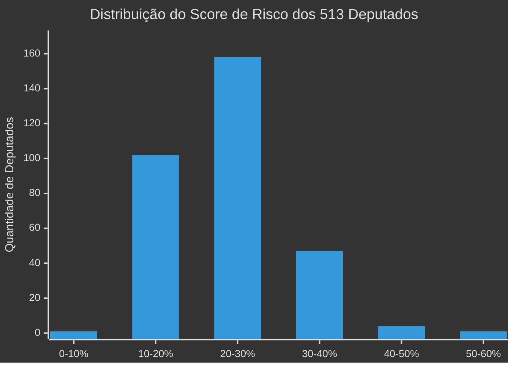
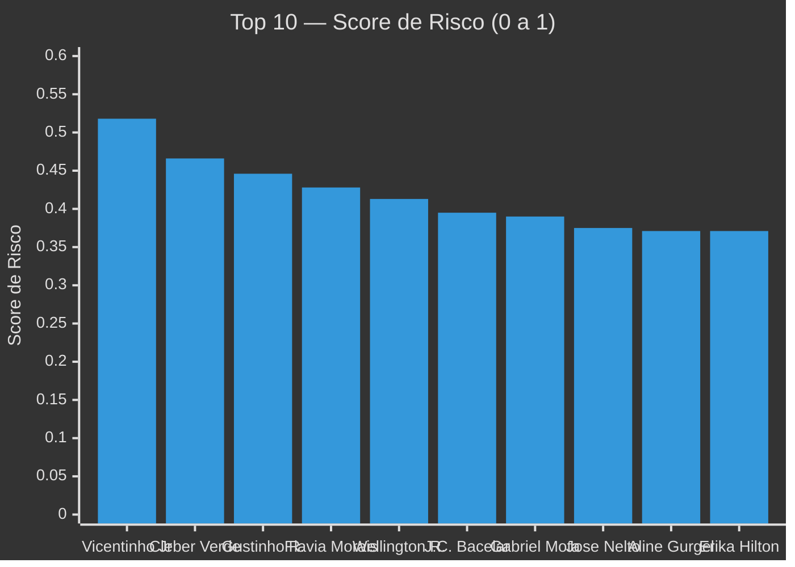
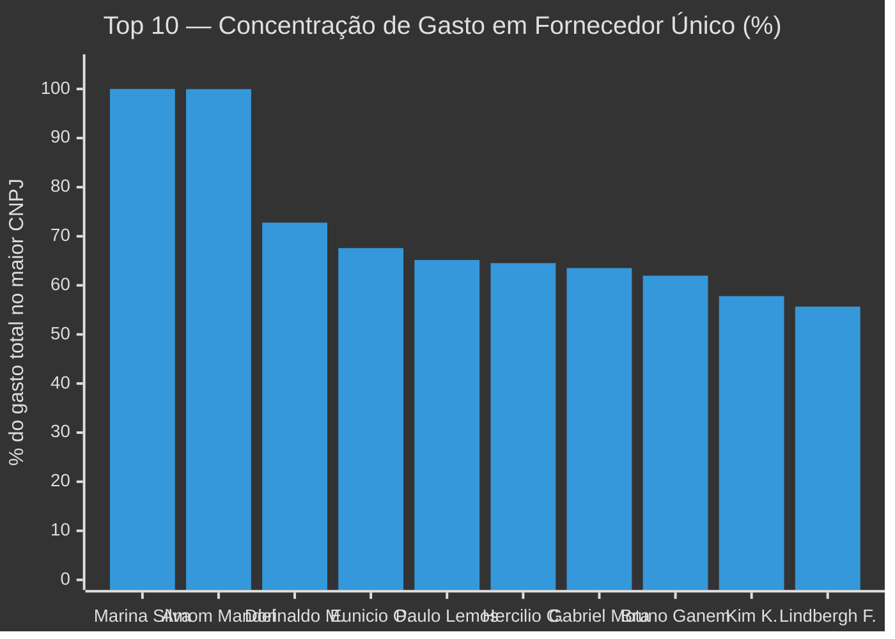
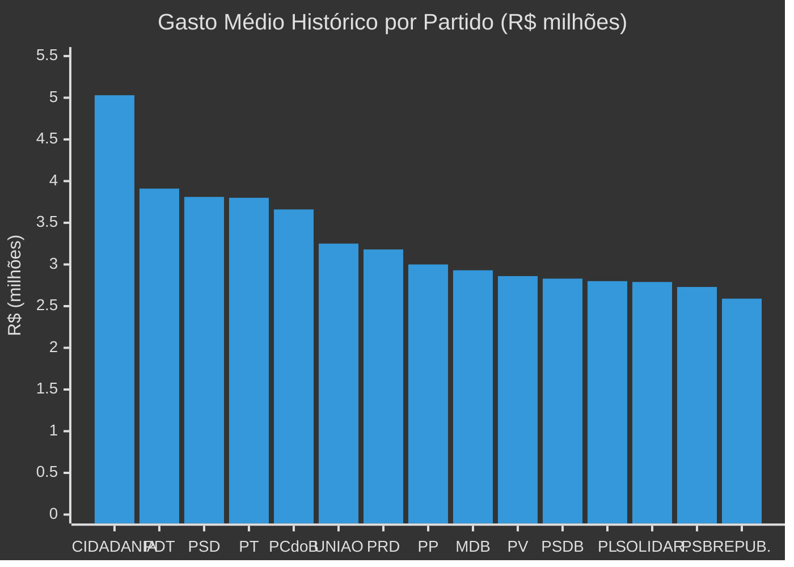

# Corrup.ORG (CORG) - Pipeline de Dados e Compliance Político

O **Corrup.ORG** é um projeto open-source de engenharia de dados e ciência de dados voltado para a fiscalização cidadã e compliance político. Ele processa grandes volumes de dados (notas fiscais da cota parlamentar, dados abertos da Câmara dos Deputados e declarações de bens do TSE) para gerar alertas matemáticos sobre o uso indevido de verba pública e enriquecimento ilícito.

## 🎯 Objetivo do Projeto
O objetivo primário do projeto é **encontrar "agulhas no palheiro"**: criar um painel (perfil final) que calcule indicadores estatísticos (KPIs) de atenção para cada deputado federal. O sistema deve apontar de forma automática:
- Quem está concentrando grandes fortunas da cota em um único fornecedor (risco de notas frias).
- Quem está enriquecendo na calada da noite (crescimento patrimonial inexplicável entre eleições).
- Quem gasta muito mais que os colegas de partido.
- Quem está disfarçando gastos em marketing ou consultorias (rubricas com alto risco de desvios).
O resultado alimenta diretamente painéis de visualização, como o Power BI, auxiliando jornalistas e auditores.

---

## ⚙️ Passo a Passo: Como Coletamos e Processamos os Dados

O pipeline roda de ponta a ponta quando você executa o arquivo `main.py`. Ele realiza o seguinte fluxo:

1. **Ingestão de Gastos Históricos (Save Point)**: O sistema lê primeiro o arquivo `historico_limpo.parquet`, que contém milhões de notas fiscais dos deputados (anos anteriores comprimidos para ganhar velocidade).
2. **Identificação dos Deputados Atuais**: Usando a API oficial da Câmara (`dadosabertos.camara.leg.br`), o sistema coleta a lista atualizada dos 513 deputados em exercício.
3. **Enriquecimento de CPF**: Como a lista inicial não traz CPFs e o CPF é essencial para cruzar com a Receita e TSE, o sistema navega no endpoint detalhado de cada deputado na API para extrair seu CPF.
4. **Cálculo de 20 KPIs (Inteligência)**: O sistema junta os gastos históricos com os 513 deputados atuais e processa cálculos pesados. Ele higieniza categorias de gastos (logística, marketing, consultoria), extrai as datas para verificar gastos em finais de semana, soma os valores e gera métricas estatísticas como o Z-Score Partidário.
5. **Módulo de Compliance Patrimonial (TSE)**: O pipeline baixa arquivos ZIP gigantes do TSE automaticamente, extrai os CSVs de "Bens" e "Consulta de Candidatos" (anos de 2018, 2020, 2022 e 2024), identifica os bens declarados e calcula a evolução patrimonial cruzando os dados através do CPF.
6. **Relatório de Cobertura**: Ao final, o sistema imprime e salva um log verificando quantos deputados ficaram de fora da base por falta de dados na Câmara ou problemas de LGPD do TSE.
7. **Geração da Base Final**: Os dados enriquecidos com todos os indicadores são exportados em `.csv` e `.parquet` na pasta `data/outputs/`.

---

## 📂 O que cada arquivo `.py` faz?

- `main.py`: É o "cérebro" (Controlador Principal) do projeto. Ele orquestra todas as etapas do pipeline e chama as funções dos outros arquivos na ordem correta.
- `src/extractors/camara.py`: Responsável pela conexão com as APIs da Câmara dos Deputados. Ele extrai os deputados em exercício e busca meticulosamente o CPF de cada um.
- `src/extract_tse.py`: O módulo de dados eleitorais. Ele faz download de ZIPs massivos do TSE, procura os arquivos consolidados do Brasil, agrupa os bens por candidato, faz o cruzamento pelo CPF e calcula o crescimento bruto patrimonial.
- `src/transform.py`: O motor estatístico do projeto. Ele recebe os dados brutos de notas fiscais e aplica as fórmulas complexas (Pandas) para gerar os 20 KPIs de risco, perfil financeiro e anomalias de subcotas.
- `src/relatorio_cobertura.py`: Função de monitoramento que checa a qualidade da ingestão. Verifica se algum dos 513 deputados ficou sem dados de gastos ou de patrimônio e alerta o usuário no terminal.
- `src/utils.py`: Funções auxiliares (helpers), incluindo o sistema de `log_progresso` com timestamps, que mantêm a saída visual no terminal elegante e rastreável.
- `src/extract.py` e `src/database.py`: Módulos antigos e arquivos de banco de dados locais (SQLite). São mantidos no repositório para fins de retrocompatibilidade ou para migrações futuras.

---

## 🛠️ Tecnologias Necessárias
- **Pandas**: Manipulação e análise de dados tabulares.
- **Requests** e **Urllib**: Integração com APIs e download de ZIPs da Câmara e TSE.
- **PyArrow** / **FastParquet**: Leitura e escrita otimizada no formato Parquet.

### Como Rodar o Projeto
1. Certifique-se de que o Python (versão 3.8 ou superior) esteja instalado.
2. Abra o terminal na pasta raiz e instale as dependências: `pip install -r requirements.txt`
3. Rode o script principal:
**No Windows (PowerShell):**
```powershell
$env:PYTHONUTF8=1; python main.py
```
**No Linux / macOS:**
```bash
PYTHONUTF8=1 python main.py
```

---

## 📖 Dicionário de KPIs (Indicadores de Risco)
*Abaixo estão os indicadores consolidados gerados no `perfil_final_politicos.csv`:*

### Categoria 1: Financeiros
- **`kpi_ticket_medio`**: Ticket médio por nota fiscal (Total gasto / quantidade de notas).
- **`kpi_max_nota_unica`**: O valor da maior nota fiscal única emitida pelo deputado.
- **`kpi_volatilidade_gastos`**: Desvio padrão dos valores das notas (indica picos muito anormais).

### Categoria 2: Concentração e Fornecedores (Risco de Laranjas)
- **`kpi_qtd_fornecedores`**: Total de CNPJs contratados.
- **`kpi_concentracao_fornecedor`**: Porcentagem do gasto total enviada a um ÚNICO fornecedor (0 a 1).
- **`kpi_max_notas_mesmo_cnpj`**: Número máximo de notas para um mesmo fornecedor.
- **`kpi_diversidade_fornecedor`**: Razão entre total de notas e a quantidade de CNPJs únicos.

### Categoria 3: Temáticos / Subcotas
- **`kpi_pct_marketing`**: Gastos com "Divulgação da Atividade Parlamentar".
- **`kpi_pct_logistica`**: Gastos em viagens (Combustíveis, Passagens, Aluguéis de veículos).
- **`kpi_pct_consultoria`**: Consultorias técnicas e segurança privada.
- **`kpi_subcota_mais_frequente`**: A subcota mais usada repetidas vezes.

### Categoria 4: Temporal e Frequência
- **`kpi_notas_por_mes`**: Média de emissão de notas.
- **`kpi_pct_notas_fds`**: Porcentagem de notas fiscais geradas em fins de semana.

### Categoria 5: Scores e Benchmarks
- **`kpi_zscore_partido`**: Z-Score apontando se ele gasta de forma obscena comparado aos pares de seu próprio partido.
- **`kpi_zscore_uf`**: Z-Score do gasto em relação aos conterrâneos de estado.
- **`kpi_score_risco`**: **Score Geral de Atenção (0 a 1)**.

### Categoria 6: Evolução Patrimonial (TSE)
- **`crescimento_bruto_R$`** e **`crescimento_percentual_%`**: O valor exato do crescimento dos bens (em Reais e em Porcentagem).
- **`flag_risco_patrimonial`**: Alerta crítico se o enriquecimento foi maior que R$ 3 milhões no mandato.
- **`patrimonio_2018`** e **`patrimonio_2022`**: Campos de retrocompatibilidade para dashboards legados.

---

## 📊 Resultados e Descobertas

*Dados extraídos automaticamente pelo pipeline a partir de 513 deputados federais em exercício.*

### 🎯 Distribuição do Score de Risco (0 a 1)

O `kpi_score_risco` combina 5 indicadores ponderados. A maioria dos deputados fica na faixa de 10-30%, mas os outliers acima de 40% merecem atenção:



> **Insight**: 158 deputados (30,8%) concentram-se na faixa de risco **20-30%**. Apenas 5 deputados ultrapassam a marca de 40%, sinalizando anomalias severas em múltiplos indicadores simultaneamente.

---

### 🚨 Top 10 Deputados com Maior Grau de Risco

O `kpi_score_risco` é uma **nota composta de 0 a 1** calculada a partir de 5 indicadores ponderados:

| Componente | Peso | O que mede |
|:---|:---:|:---|
| Concentração em fornecedor único | 25% | % do gasto total destinado a um único CNPJ |
| Volatilidade dos gastos | 20% | Desvio padrão dos valores das notas (picos anormais) |
| % de notas em fins de semana | 15% | Proporção de notas emitidas em sábados/domingos |
| Z-Score partidário (absoluto) | 20% | Quanto gasta acima/abaixo da média do próprio partido |
| % gasto com consultoria | 20% | Proporção em consultorias e segurança privada |



#### Tabela comparativa — KPIs vs. Mediana da Câmara

*Valores em 🔴 vermelho indicam o indicador que mais contribuiu para elevar o score.*

| # | Deputado | Partido/UF | Score | Concentr. Fornec. | Volatilidade | Notas FDS | Z-Score Partido | % Consultoria |
|:---:|:---|:---:|:---:|:---:|:---:|:---:|:---:|:---:|
| | *Mediana (referência)* | *—* | *—* | *19,2%* | *R$ 2.438* | *10,7%* | *0,77* | *0,9%* |
| 1 | **Vicentinho Júnior** | PSDB/TO | **0,518** | 44,9% | R$ 5.813 | 5,0% | 1,10 | 🔴 **48,8%** |
| 2 | **Cleber Verde** | MDB/MA | **0,466** | 10,4% | R$ 7.194 | 11,0% | 🔴 **2,76** | 13,1% |
| 3 | **Gustinho Ribeiro** | PP/SE | **0,446** | 37,6% | R$ 9.191 | 3,9% | 0,18 | 🔴 **38,2%** |
| 4 | **Flávia Morais** | MDB/GO | **0,428** | 21,1% | R$ 3.990 | 🔴 **17,4%** | 1,63 | 21,7% |
| 5 | **Wellington Roberto** | PSD/PB | **0,413** | 16,9% | R$ 5.251 | 8,0% | 🔴 **2,15** | 20,6% |
| 6 | **João C. Bacelar** | PL/BA | **0,395** | 9,7% | R$ 2.926 | 14,2% | 🔴 **2,45** | 16,4% |
| 7 | **Gabriel Mota** | UNIÃO/RR | **0,390** | 🔴 **63,5%** | R$ 8.236 | 5,0% | -0,76 | 0,4% |
| 8 | **José Nelto** | UNIÃO/GO | **0,375** | 40,3% | R$ 5.945 | 15,8% | -0,13 | 16,2% |
| 9 | **Aline Gurgel** | UNIÃO/AP | **0,371** | 12,3% | R$ 6.072 | 5,9% | -0,66 | 🔴 **39,4%** |
| 10 | **Erika Hilton** | PSOL/SP | **0,371** | 45,5% | R$ 1.546 | 🔴 **17,4%** | -0,75 | 18,6% |

#### Por que cada deputado está no Top 10?

<details>
<summary>🔎 Clique para ver a análise individual de cada deputado</summary>

**1. Vicentinho Júnior (PSDB/TO) — Score: 0,518** 🥇
> Lidera o ranking por causa de um dado alarmante: **48,8% do seu gasto total** vai para consultorias e segurança privada — a mediana da Câmara é apenas 0,9%. Também concentra 44,9% do gasto em um único fornecedor (mediana: 19,2%) e possui volatilidade de R$ 5.813 por nota (2,4x a mediana). Os três indicadores se acumulam e disparam o score.

**2. Cleber Verde (MDB/MA) — Score: 0,466**
> Gasta **R$ 8 milhões** (o dobro da mediana), gerando um Z-Score de 2,76 — ou seja, está quase 3 desvios padrão acima da média do MDB. Consultorias em 13,1% (14x a mediana) e volatilidade alta (R$ 7.194) completam o perfil. Nota máxima de R$ 105.000 em uma única nota fiscal.

**3. Gustinho Ribeiro (PP/SE) — Score: 0,446**
> **38,2% em consultorias** é o principal fator (42x a mediana). Possui a maior volatilidade do top 10 (R$ 9.191), com notas que vão de valores baixos a uma nota máxima de R$ 164.900. Opera com apenas 30 fornecedores — um dos menores números.

**4. Flávia Morais (MDB/GO) — Score: 0,428**
> Destaque para **17,4% de notas em fins de semana** (63% acima da mediana). Gasta R$ 5,9M (Z-Score de 1,63 no MDB) e destina 21,7% a consultorias. É a combinação de vários indicadores moderadamente altos que eleva o score.

**5. Wellington Roberto (PSD/PB) — Score: 0,413**
> Com R$ 8,6 milhões, tem um **Z-Score de 2,15** dentro do PSD. Gastou 20,6% em consultorias (23x a mediana) e 48,2% em marketing. Volatilidade de R$ 5.251 com nota máxima de R$ 84.500.

**6. João Carlos Bacelar (PL/BA) — Score: 0,395**
> Z-Score de **2,45 no PL** (gasta R$ 7,2M enquanto a média do partido é R$ 2,8M). Além disso, 16,4% em consultorias, 14,2% de notas em FDS e **flag de risco patrimonial ativo** (crescimento de R$ 6 milhões no TSE). Opera com 959 fornecedores.

**7. Gabriel Mota (UNIÃO/RR) — Score: 0,390**
> O caso mais clássico de concentração: **63,5% do gasto vai para um único CNPJ** (3,3x a mediana). Trabalha com apenas 23 fornecedores e tem um ticket médio de R$ 7.770 — o mais alto do top 10. Volatilidade de R$ 8.236 confirma picos de gasto.

**8. José Nelto (UNIÃO/GO) — Score: 0,375**
> Caso especialmente grave: combina concentração de 40,3% em fornecedor, 15,8% de notas em FDS, 16,2% em consultorias E um **crescimento patrimonial de R$ 40,6 milhões** (2º maior da Câmara). Destina 69,8% do gasto a marketing.

**9. Aline Gurgel (UNIÃO/AP) — Score: 0,371**
> **39,4% em consultorias** (44x a mediana) é o principal gatilho. Volatilidade de R$ 6.072 (2,5x a mediana) e nota máxima de R$ 50.000. Opera com apenas 63 fornecedores com ticket médio de R$ 2.772.

**10. Erika Hilton (PSOL/SP) — Score: 0,371**
> Concentra **45,5% do gasto em um único CNPJ** (2,4x a mediana) e emite **17,4% das notas em FDS**. Gasta 18,6% em consultorias. O gasto total é baixo (R$ 1,3M), mas a distribuição atípica entre fornecedores e dias da semana eleva o score.

</details>

> **⚠️ Importante**: O score de risco é um **indicador estatístico**, não uma acusação. Valores altos indicam **padrões atípicos** que merecem investigação aprofundada — não necessariamente irregularidade.

---

### 💰 Como os Deputados Gastam a Cota Parlamentar


> **Insight**: **42,9% da cota** vai para logística (combustíveis + passagens aéreas), seguido de **33,6% em marketing**. Consultorias representam apenas 4,3% do total, mas são a subcota com maior risco de superfaturamento.

---

### 🏛️ Top 10 Estados por Gasto Médio da Cota

| # | UF | Gasto Médio | Barra Visual |
|---|:---:|---:|:---|
| 1 | **PB** | R$ 4.352.509 | 🟥🟥🟥🟥🟥🟥🟥🟥🟥🟥🟥🟥🟥🟥🟥🟥🟥🟥🟥🟥 |
| 2 | **BA** | R$ 4.152.878 | 🟥🟥🟥🟥🟥🟥🟥🟥🟥🟥🟥🟥🟥🟥🟥🟥🟥🟥🟥 |
| 3 | **MS** | R$ 3.879.798 | 🟥🟥🟥🟥🟥🟥🟥🟥🟥🟥🟥🟥🟥🟥🟥🟥🟥🟥 |
| 4 | **RS** | R$ 3.737.030 | 🟥🟥🟥🟥🟥🟥🟥🟥🟥🟥🟥🟥🟥🟥🟥🟥🟥 |
| 5 | **MG** | R$ 3.417.409 | 🟥🟥🟥🟥🟥🟥🟥🟥🟥🟥🟥🟥🟥🟥🟥🟥 |
| 6 | **PR** | R$ 3.308.364 | 🟥🟥🟥🟥🟥🟥🟥🟥🟥🟥🟥🟥🟥🟥🟥 |
| 7 | **CE** | R$ 3.268.606 | 🟥🟥🟥🟥🟥🟥🟥🟥🟥🟥🟥🟥🟥🟥🟥 |
| 8 | **AP** | R$ 3.129.211 | 🟥🟥🟥🟥🟥🟥🟥🟥🟥🟥🟥🟥🟥🟥 |
| 9 | **PE** | R$ 3.058.755 | 🟥🟥🟥🟥🟥🟥🟥🟥🟥🟥🟥🟥🟥🟥 |
| 10 | **MA** | R$ 2.877.152 | 🟥🟥🟥🟥🟥🟥🟥🟥🟥🟥🟥🟥🟥 |

> **Insight**: Paraíba (PB) lidera com R$ 4,35M de gasto médio por deputado — **51% acima** da média do Maranhão (10º lugar). Estados do Nordeste dominam o ranking.

---

### ⚠️ Alerta Patrimonial: 26 Deputados com Enriquecimento > R$ 3 Milhões

O cruzamento com dados do TSE (declarações de bens de 2018 a 2024) identificou **26 deputados** cujo crescimento patrimonial ultrapassou R$ 3 milhões entre eleições:

| # | Deputado | Partido/UF | Crescimento Bruto | Período |
|---|:---|:---:|---:|:---:|
| 1 | **Eunício Oliveira** | MDB/CE | R$ 68.945.783 | 2018→2022 |
| 2 | **José Nelto** | UNIÃO/GO | R$ 40.649.515 | 2018→2022 |
| 3 | **Hercílio Coelho Diniz** | MDB/MG | R$ 27.059.043 | 2018→2022 |
| 4 | **Misael Varella** | PSD/MG | R$ 22.992.335 | 2018→2022 |
| 5 | **Felipe Carreras** | PSB/PE | R$ 9.439.911 | 2018→2022 |
| 6 | **Márcio Honaiser** | SOLIDARIEDADE/MA | R$ 8.248.386 | 2018→2022 |
| 7 | **Glaustin da Fokus** | PODE/GO | R$ 7.556.935 | 2018→2022 |
| 8 | **Mário Heringer** | PDT/MG | R$ 7.505.997 | 2018→2022 |
| 9 | **Luciano Vieira** | PSDB/RJ | R$ 6.911.336 | 2020→2022 |
| 10 | **Vinicius Gurgel** | PL/AP | R$ 6.713.167 | 2018→2022 |

<details>
<summary>📋 Ver todos os 26 deputados flagrados</summary>

| # | Deputado | Partido/UF | Crescimento Bruto |
|---|:---|:---:|---:|
| 11 | Marcelo Queiroz | PSDB/RJ | R$ 6.538.477 |
| 12 | Bandeira de Mello | PV/RJ | R$ 6.085.879 |
| 13 | João Carlos Bacelar | PL/BA | R$ 6.048.260 |
| 14 | Dal Barreto | UNIÃO/BA | R$ 5.506.008 |
| 15 | Átila Lira | PP/PI | R$ 4.999.564 |
| 16 | Giovani Cherini | PL/RS | R$ 4.779.885 |
| 17 | Rodolfo Nogueira | PL/MS | R$ 4.346.738 |
| 18 | Arthur Lira | PP/AL | R$ 4.246.946 |
| 19 | Magda Mofatto | PL/GO | R$ 3.932.329 |
| 20 | Eduardo Velloso | SOLIDARIEDADE/AC | R$ 3.822.171 |
| 21 | Vander Loubet | PT/MS | R$ 3.801.009 |
| 22 | Josivaldo JP | UNIÃO/MA | R$ 3.795.835 |
| 23 | Paulo Abi-Ackel | PSDB/MG | R$ 3.553.367 |
| 24 | Filipe Martins | PL/TO | R$ 3.280.558 |
| 25 | Ricardo Barros | PP/PR | R$ 3.224.282 |
| 26 | Elcione Barbalho | MDB/PA | R$ 3.010.258 |

</details>

> **⚠️ Nota**: Crescimento patrimonial elevado **não é prova de irregularidade**. Pode ser resultado de heranças, vendas legítimas, ou atividade empresarial. O indicador aponta **atenção**, não culpa.

---

### 🔍 Concentração de Fornecedores — Risco de Notas Frias

Deputados que direcionam grande parte da cota para um **único CNPJ** levantam suspeitas de empresas "laranja":



> **Insight**: Marina Silva (REDE) tem 100% do gasto concentrado — porém com valor total baixo, o que pode indicar poucos registros no histórico. Já **Eunício Oliveira (MDB)** aparece tanto na concentração de fornecedor (67,6%) quanto no crescimento patrimonial (R$ 68M), o que eleva significativamente o perfil de atenção.

---

### 📅 Notas Fiscais em Fins de Semana

| Métrica | Valor |
|:---|---:|
| Média geral de notas em FDS | **10,92%** |
| Máximo individual | **22,51%** |
| Deputados com > 15% em FDS | Atenção elevada |

> **Insight**: A média de ~11% é esperada (2/7 dias = 28,5% seria uniforme). Deputados acima de 15% merecem verificação, pois notas em fins de semana podem indicar despesas fictícias.

---

### 🏛️ Gasto Médio por Partido



> **Insight**: O CIDADANIA lidera com R$ 5,03M de gasto médio, mas possui apenas 2 deputados — o que pode distorcer a média. Os partidos com bancadas grandes (PL com 95, PT com 66, PSD com 47) giram em torno de R$ 2,8M–3,8M.